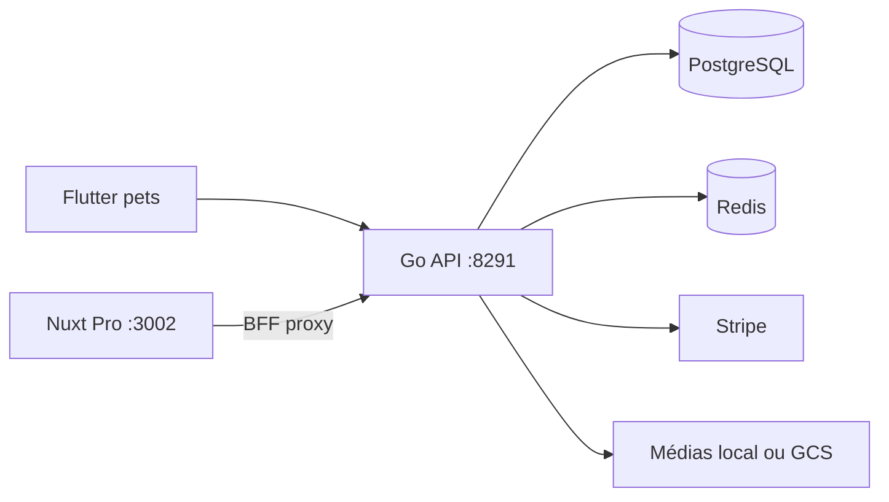

# Architecture — petsFollow

## Dual-face

| Face | Stack | Port / URL local | Rôles |
|------|-------|------------------|-------|
| **Pro** | Nuxt 3 (`nuxtjs/`) | http://localhost:3002 | véto, admin, commercial |
| **pets** | Flutter (`flutter/`) | — | client propriétaire |
| **API** | Go + Chi (`go/`) | http://localhost:8291 | `/api/v1` |

## Couches

- **BFF Nuxt** : `nuxtjs/server/api/` proxy vers l’API ; pages consomment `{ data }` (souvent `res.data ?? res`).
- **API Go** : handlers (`go/internal/handlers/`), store (`go/internal/store/`), billing (`go/internal/billing/`).
- **Auth** : JWT access + refresh ; Google OAuth optionnel ; 2FA TOTP.
- **i18n** : `Accept-Language` + `users.preferred_locale` (FR / NL / EN / ES / ET).

## Infra données

| Composant | Local | Staging |
|-----------|-------|---------|
| Postgres | Docker (`make up-infra`) | Cloud SQL `petsfollow` |
| Redis | Docker | VM `shared-redis` DB **14** |
| Médias | `./data/uploads` → `/media/` | GCS `petsfollow-media` |

Schémas SQL principaux : `identity`, `practice`, `pets`, `heartrate`, `messaging`, `notifications`, `billing`, `sales`, `care`, `visits`, `discovery`.

## Déploiement

Staging Cloud Run + LB : [10-GCP-DEPLOIEMENT.md](10-GCP-DEPLOIEMENT.md).

## Hors scope runtime

Firebase Auth **non utilisé** (auth = API Go). Firebase = infra mobile (FCM post-MVP).
