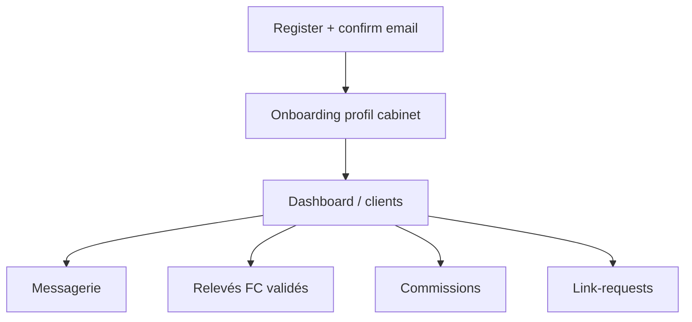
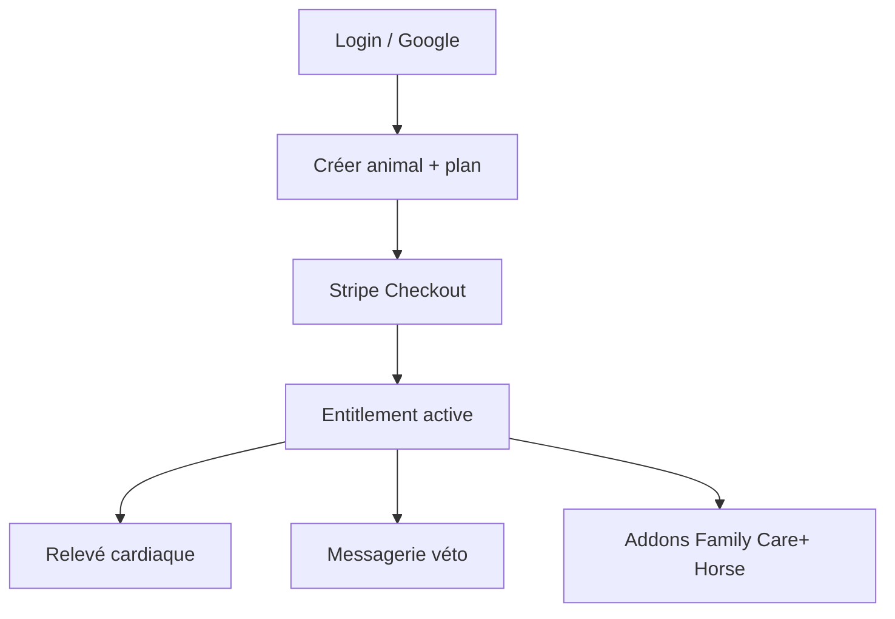
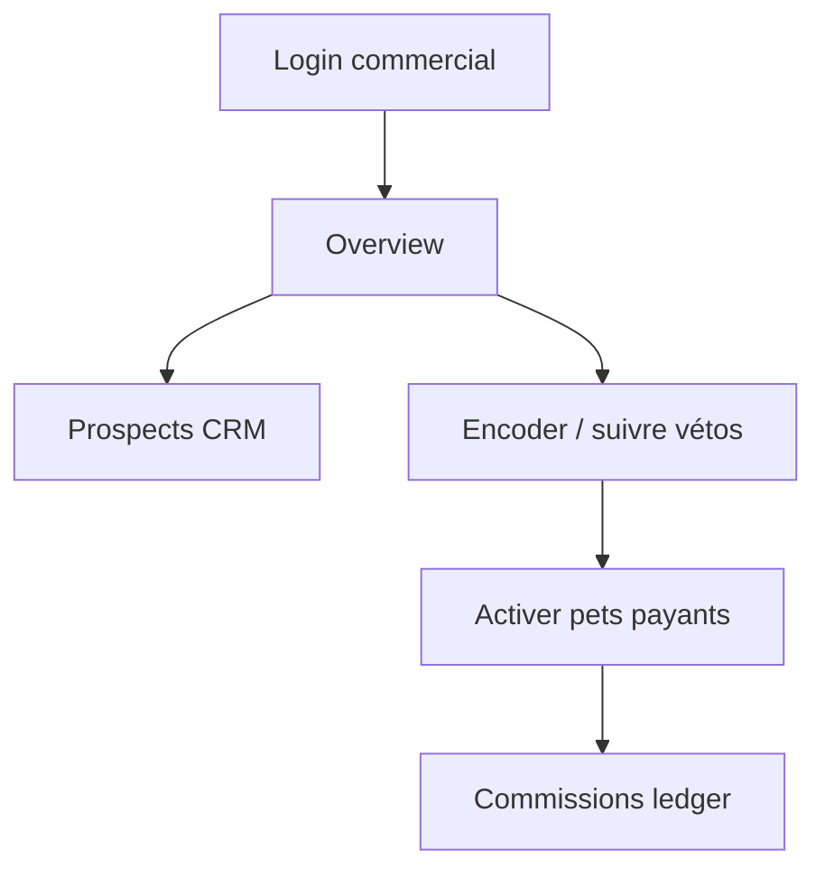

# Flux utilisateurs — petsFollow

## Rôles

| Rôle | Surface | Mission |
|------|---------|---------|
| `vet` | Pro | Prescrire / suivre / messagerie |
| `client` | Flutter pets | Animaux, FC, paiement, messages |
| `commercial` | Pro | Apporter cabinets, prospects, activations |
| `admin` | Pro | Ops plateforme, commissions, commercials |

## Parcours véto

## Parcours client

## Parcours commercial

## Parcours admin

Login → métriques → users / payments → commercials (créer, assigner) → clôture périodes commissions véto & commercial.

## Démo

Comptes seed : [AGENTS.md](../AGENTS.md) · fiche produit commercial : [22](22-FICHE-PRODUIT-COMMERCIAL.md).
