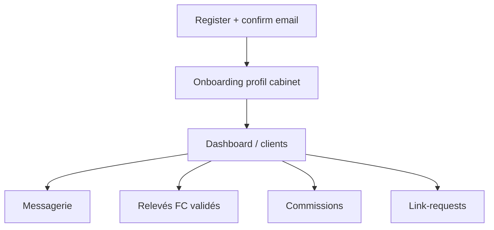
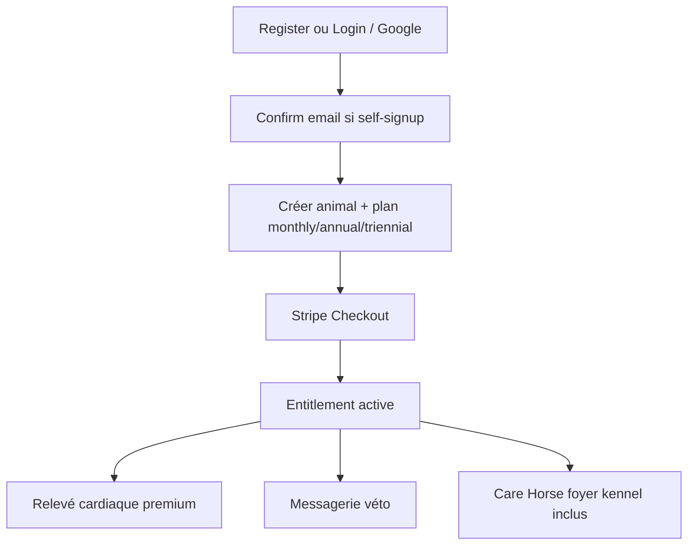
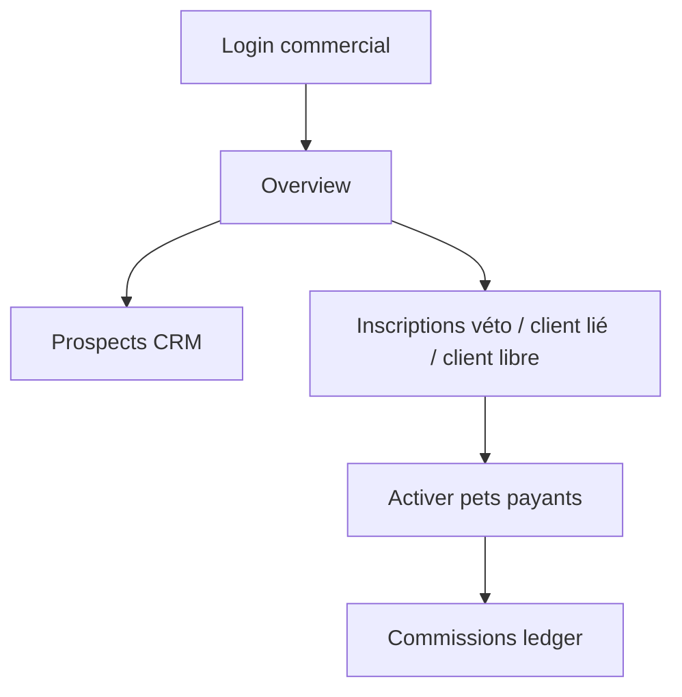
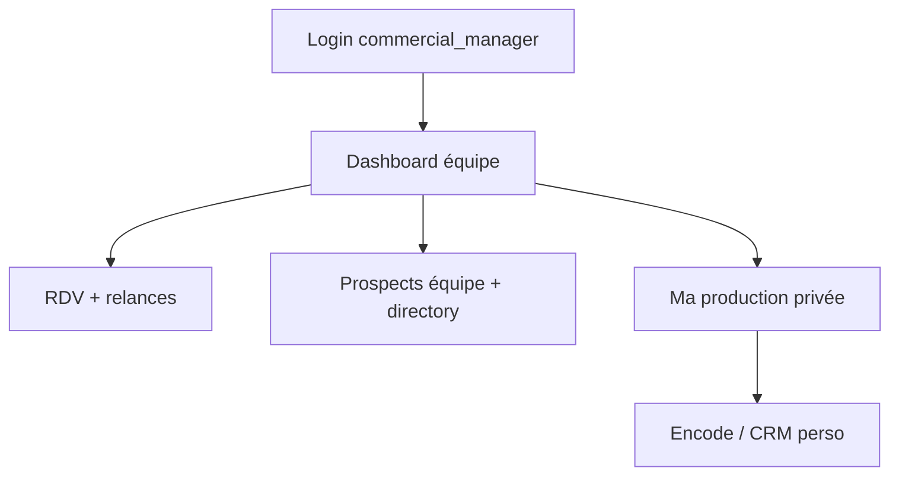

# Flux utilisateurs — petsFollow

## Rôles

| Rôle | Surface | Mission |
|------|---------|---------|
| `vet` | Pro web | Prescrire / suivre / messagerie / partage dossier |
| `client` | Flutter pets | Self-signup, animaux, FC, paiement, messages |
| `care_pro` | Flutter pro light | Agenda terrain, fiches, CR (specialty : vet_light, farrier, …) |
| `commercial` | Pro | Apporter cabinets, prospects, activations |
| `commercial_manager` | Pro | Piloter l’équipe commerciale (KPI contact / RDV / résultat) + portefeuille perso |
| `admin` | Pro | Ops plateforme, commissions, commercials |

Détail multi-profils / ACL : [28-MULTI-PROFILS-PRO.md](28-MULTI-PROFILS-PRO.md).

## Parcours véto

## Parcours client

Paiement plan → entitlement actif : Care / Horse / foyer / kennel inclus. Premium FC + messagerie restent conditionnés au paiement. Addons Family / Kennel / Care+ / Horse = legacy hors vente (pas d’étape upsell).

En parallèle (engagement) :

- **Discovery in-app** (accueil Flutter) : missions J0 / J2 / J4 / J6
- **Parcours email 12 mois** : drip éducatif (voir [23-PARCOURS-EMAIL-CLIENT.md](23-PARCOURS-EMAIL-CLIENT.md)) — opt-out via pref `discovery`

## Parcours commercial

## Parcours responsable commercial

## Parcours admin

Login → métriques → users / payments → commercials (créer, assigner) → clôture périodes commissions véto & commercial.

## Démo

Comptes seed : [AGENTS.md](../AGENTS.md) · fiche produit commercial : [22](22-FICHE-PRODUIT-COMMERCIAL.md).
