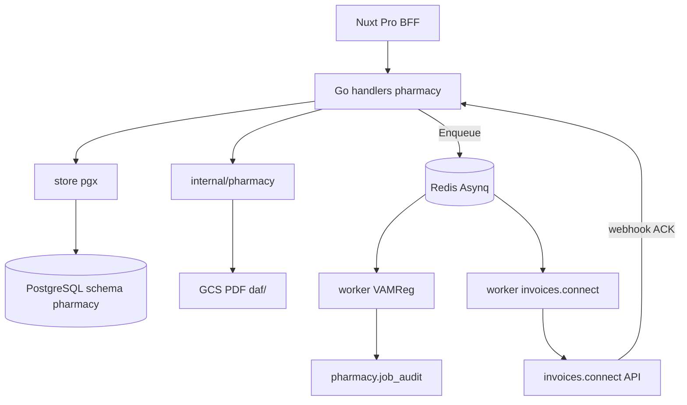

# 27 — Pharmacie vétérinaire Belgique (Phase 1)

Document de **mise en place** (architecture, modèle, API, infra, sprints).  
**Statut** : spécification — **non implémenté** dans le code au moment de la rédaction.

Ne confondre pas avec l’addon **Care+** (rappels médicaments côté client Flutter) : ce module est une **pharmacie cabinet** (Pro Nuxt), multi-tenant `practice_id`, alignée sur les contraintes belges (CNK / AFMPS, DAF, VAMReg).

---

## 1. Objectif & périmètre

### Objectif

Adapter PetsFollow au circuit médicament du cabinet vétérinaire en Belgique :

1. **Dictionnaire** médicaments belges (codes CNK / AFMPS) — import + recherche ultrarapide.
2. **Stocks multi-dépôts** avec stratégie **FEFO** (First Expired, First Out) et traçabilité par **numéro de lot**.
3. **Documents d’Administration et de Fourniture (DAF)** — numérotation séquentielle inviolable + PDF archivé.
4. **Worker asynchrone VAMReg** (déclaration antibiotiques) via Redis / Asynq.
5. **Connecteur invoices.connect** — export asynchrone des DAF finalisés vers la facturation tierce.

### Hors scope Phase 1

| Exclu | Note |
|-------|------|
| UI Flutter client | Aucune surface pets |
| Facturation Stripe liée aux DAF | Stripe reste abonnements / addons plateforme |
| Multi-cabinet cross-practice | Isolation stricte `practice_id` |
| Signature électronique avancée | PDF généré + hash ; pas de eID / eSeal |
| Remplacement légal d’un logiciel DAF certifié | PetsFollow prépare le flux ; validation réglementaire externe |

### Prérequis monorepo (état actuel)

| Composant | État | Réemploi |
|-----------|------|----------|
| API Go + `store` pgx | Livré | Pattern handlers → store |
| Schémas SQL + migrations `000001`…`000038` | Livré | Nouveau schéma `pharmacy`, migrations `000039+` |
| Redis (local Docker + staging DB **14**) | Provisionné | Config `REDIS_*` présente ; **pas encore de client Asynq** |
| GCS `petsfollow-media` | Livré | PDF DAF via `platform/media` (`kind=daf`) |
| Génération PDF | Absente | À introduire dans `internal/pharmacy` |
| Nuxt Pro `vet-only` + BFF | Livré | Pages `/medicaments`, `/stock`, `/daf` |
| Autocomplete Combobox Pro | Absent | Nouveau `ProCombobox.vue` |

Références : [02-ARCHITECTURE.md](02-ARCHITECTURE.md), [03-MODELE-DONNEES.md](03-MODELE-DONNEES.md), [10-GCP-DEPLOIEMENT.md](10-GCP-DEPLOIEMENT.md).

---

## 2. Architecture cible



### Principes d’alignement

| Existants | Choix Phase 1 |
|-----------|---------------|
| `handlers` → `store` (pgx) | Même pattern ; **pas** de couche `repositories/` séparée |
| Domaine isolé = `internal/billing/` | Nouveau package `internal/pharmacy/` |
| Background = journey in-process | **Nouveau** : Asynq + Redis (prefix `petsfollow:asynq:`) |
| Médias GCS | Réutiliser `platform/media` |
| Multi-tenant | Tout scoppé `practice_id` (comme `visits`, `care`) |
| Feature flag | `PHARMACY_ENABLED` (déploiement progressif staging) |

### Structure dossiers proposée (Backend Go)

```text
go/internal/
├── pharmacy/                         # domaine (règles FEFO, DAF, payloads)
│   ├── domain.go
│   ├── daf_number.go                 # allocation gapless
│   ├── stock.go                      # décrément FEFO atomique
│   ├── pdf.go                        # HTML → PDF
│   ├── vamreg.go
│   └── invoices_connect.go
├── handlers/
│   ├── pharmacy_medications.go
│   ├── pharmacy_stock.go
│   ├── pharmacy_daf.go
│   └── pharmacy_exports.go
├── store/
│   ├── pharmacy_ref.go
│   ├── pharmacy_stock.go
│   └── pharmacy_daf.go
├── workers/                          # NOUVEAU
│   ├── server.go
│   ├── enqueue.go
│   ├── vamreg_handler.go
│   └── invoices_connect_handler.go
└── platform/db/migrations/
    ├── 000039_pharmacy_ref.up.sql
    ├── 000040_pharmacy_stock.up.sql
    ├── 000041_pharmacy_daf.up.sql
    └── 000042_pharmacy_jobs_audit.up.sql
```

CLI import CNK : sous-commande `import-cnk` sur `cmd/petsfollow-api` (ou binaire dédié `go/cmd/import-cnk/`) — **jamais** dans une requête HTTP Cloud Run.

Wiring : `app.New` démarre le serveur Asynq si `REDIS_ADDR` + `PHARMACY_WORKERS_ENABLED=true`.

**Recommandation staging** : service Cloud Run séparé `petsfollow-worker` (même image, commande worker) pour scaler indépendamment de l’API HTTP.

### Structure dossiers proposée (Nuxt Pro)

```text
nuxtjs/
├── pages/
│   ├── medicaments/index.vue         # catalogue + recherche
│   ├── stock/
│   │   ├── index.vue                 # dépôts + lots
│   │   └── mouvements.vue
│   └── daf/
│       ├── index.vue
│       ├── nouveau.vue               # wizard
│       └── [dafId].vue
├── components/pro/ProCombobox.vue
├── composables/usePharmacyApi.ts
├── server/api/vet/
│   ├── medications/search.get.ts
│   ├── deposits/...
│   ├── batches/...
│   ├── daf/...
│   └── exports/...
└── locales/{fr,en,nl,es}.json        # nav.* + pharmacy.*
```

Nav véto (`layouts/default.vue`) : **Médicaments** · **Stock** · **DAF**.  
Middleware : `vet-only`. Lien animal (section fiche pet) = Phase 1.1 optionnelle.

---

## 3. Modèle de données PostgreSQL

Nouveau schéma : `pharmacy`.  
Source de vérité à l’implémentation : migrations `000039` → `000042`.

### 3.1 `pharmacy.ref_medications` (dictionnaire national, partagé)

| Colonne | Type | Contraintes / notes |
|---------|------|---------------------|
| `id` | `UUID` | PK, `gen_random_uuid()` |
| `cnk` | `TEXT` | `NOT NULL UNIQUE` — Code CNK |
| `name` | `TEXT` | `NOT NULL` |
| `name_normalized` | `TEXT` | `lower(unaccent(name))` pour recherche |
| `atc_code` | `TEXT` | nullable |
| `pharmaceutical_form` | `TEXT` | nullable |
| `pack_size` | `TEXT` | nullable |
| `is_antibiotic` | `BOOLEAN` | `NOT NULL DEFAULT false` |
| `is_active` | `BOOLEAN` | `NOT NULL DEFAULT true` |
| `afmps_meta` | `JSONB` | champs bruts import |
| `updated_at` | `TIMESTAMPTZ` | |

**Index**

- `UNIQUE (cnk)`
- GIN FTS : `to_tsvector('simple', name_normalized || ' ' || cnk)`
- GIN trigram (`pg_trgm`) sur `name_normalized` — autocomplete flou
- Btree `(is_antibiotic)` si filtres fréquents

Extensions à activer en migration : `pg_trgm`, `unaccent` (si pas déjà présentes).

### 3.2 `pharmacy.medication_deposits`

| Colonne | Type | Notes |
|---------|------|-------|
| `id` | `UUID` | PK |
| `practice_id` | `UUID` | `NOT NULL REFERENCES practice.practices(id)` |
| `name` | `TEXT` | `NOT NULL` |
| `code` | `TEXT` | ex. `MAIN`, `FRIDGE` |
| `is_default` | `BOOLEAN` | `DEFAULT false` |
| | | `UNIQUE (practice_id, code)` |

### 3.3 `pharmacy.medication_batches`

| Colonne | Type | Notes |
|---------|------|-------|
| `id` | `UUID` | PK |
| `practice_id` | `UUID` | `NOT NULL` |
| `deposit_id` | `UUID` | FK `medication_deposits` |
| `medication_id` | `UUID` | FK `ref_medications` |
| `lot_number` | `TEXT` | `NOT NULL` |
| `expires_on` | `DATE` | `NOT NULL` |
| `qty_on_hand` | `NUMERIC(12,3)` | `NOT NULL CHECK (qty_on_hand >= 0)` |
| `unit` | `TEXT` | `unit` \| `ml` \| `box` \| … |
| | | `UNIQUE (practice_id, deposit_id, medication_id, lot_number, expires_on)` |

**Index FEFO** (partiel) :

```text
(practice_id, medication_id, deposit_id, expires_on ASC)
WHERE qty_on_hand > 0
```

### 3.4 `pharmacy.stock_movements`

Audit immuable des mouvements :

| Colonne | Notes |
|---------|-------|
| `id`, `practice_id`, `batch_id` | |
| `delta` | `NUMERIC` (négatif = sortie) |
| `reason` | `receipt` \| `daf` \| `adjust` \| `waste` \| `daf_cancel` |
| `daf_item_id` | nullable |
| `created_by`, `created_at` | |

### 3.5 `pharmacy.daf_sequences` (numérotation gapless)

| Colonne | Notes |
|---------|-------|
| `practice_id` | PK composite |
| `daf_year` | PK composite — série annuelle |
| `next_number` | `BIGINT NOT NULL` — prochain numéro à attribuer |

Allocation **uniquement** dans la TX de finalize : `SELECT … FOR UPDATE` → lire → incrémenter → insert DAF.

**Ne pas** utiliser une `SEQUENCE` Postgres nue : un `ROLLBACK` après `nextval()` crée des trous.

### 3.6 `pharmacy.daf_documents`

| Colonne | Notes |
|---------|-------|
| `id` | UUID PK |
| `practice_id` | NOT NULL |
| `daf_year` | INT NOT NULL |
| `daf_number` | BIGINT — **nullable en draft**, NOT NULL dès `finalized` |
| `status` | `draft` \| `finalized` \| `cancelled` |
| `client_user_id`, `pet_id` | nullable selon cas |
| `prescriber_user_id` | véto émetteur |
| `issued_at`, `finalized_at` | |
| `pdf_object_key`, `pdf_sha256` | GCS + intégrité |
| `has_antibiotic` | dénormalisé au finalize |
| `vamreg_status` | `n/a` \| `pending` \| `sent` \| `failed` |
| `invoices_export_status` | `n/a` \| `pending` \| `sent` \| `failed` |
| | `UNIQUE (practice_id, daf_year, daf_number)` où numéro non null |

Règle : `cancelled` **conserve** le numéro (annulation documentée ≠ trou technique).

### 3.7 `pharmacy.daf_items`

| Colonne | Notes |
|---------|-------|
| `id`, `daf_id` | FK `ON DELETE RESTRICT` |
| `medication_id` | |
| `batch_id` | lot réellement sorti (renseigné au finalize) |
| `qty`, `unit` | |
| `is_antibiotic` | dénormalisé |
| `vamreg_payload` | JSONB — champs obligatoires si antibiotique |

### 3.8 `pharmacy.job_audit`

| Colonne | Notes |
|---------|-------|
| `id` | |
| `job_type` | `vamreg` \| `invoices_connect` |
| `entity_id` | `daf_id` |
| `attempt` | INT |
| `status` | `started` \| `success` \| `failed` |
| `request_json`, `response_json` | |
| `error` | TEXT |
| `created_at` | |

Index : `(job_type, entity_id, created_at DESC)`.

---

## 4. Règles métier critiques

### 4.1 Numérotation DAF sans trous

1. Les **drafts n’ont pas de numéro**.
2. Le numéro est alloué **uniquement** au `finalize`, dans la **même transaction** que le lock `daf_sequences` + FEFO + insert items/lots.
3. `cancelled` ne libère pas le numéro.
4. Filet DB : `UNIQUE (practice_id, daf_year, daf_number)`.
5. Format d’affichage recommandé UI : `DAF-{year}-{number:06d}` (ex. `DAF-2026-000042`).

### 4.2 Stock FEFO & concurrence

Algorithme `AllocateFEFO(tx, practice, medication, depositOpt, qty)` :

1. `SELECT … FROM medication_batches WHERE practice_id = $1 AND medication_id = $2 AND qty_on_hand > 0 [AND deposit_id = $3] ORDER BY expires_on ASC, created_at ASC FOR UPDATE`
2. Répartir `qty` sur N lots (du plus proche de la péremption au plus lointain).
3. Si stock insuffisant → erreur métier / HTTP **409** (`ErrConflict`).
4. Insert `stock_movements` (`reason=daf`, `delta < 0`).
5. Lier chaque `daf_items.batch_id`.

Concurrence : row locks Postgres + `CHECK (qty_on_hand >= 0)`.  
Test obligatoire : 2 TX parallèles sur le même lot → une seule réussit sans qty négative.

**Finalize DAF** = une seule TX ACID :

```text
BEGIN
  lock daf_sequences FOR UPDATE
  allocate daf_number
  pour chaque ligne: AllocateFEFO
  set has_antibiotic / vamreg_status / invoices_export_status
  COMMIT
puis (hors TX) :
  générer PDF → GCS
  enqueue Asynq (vamreg / invoices_connect)
```

### 4.3 Annulation DAF

- Statut → `cancelled` (pas de hard delete).
- Numéro conservé.
- Reverse stock : mouvements `reason=daf_cancel` (delta positif) sur les mêmes `batch_id` si politique métier = restock ; sinon `waste` si produit déjà administré (paramétrable / choix UI).

### 4.4 Antibiotiques (`is_antibiotic = true`)

| Couche | Comportement |
|--------|----------------|
| Catalogue / Combobox | Badge ambre + clé i18n `pharmacy.antibioticWarning` |
| Wizard DAF | **Bloquer finalize** tant que `vamreg_payload` incomplet (espèce, indication, durée, … — liste figée en `pharmacy/vamreg.go`) |
| Après finalize | `has_antibiotic=true`, `vamreg_status=pending`, enqueue task VAMReg |
| UI détail | Panneau statut `pending` / `sent` / `failed` + bouton retry si `failed` |

### 4.5 PDF

- Généré **après** commit finalize (échec PDF ≠ rollback numéro — retry génération idempotent sur `daf_id`).
- Stockage : clé `daf/{practice_id}/{daf_id}.pdf` (via `media.ObjectKey`).
- `pdf_sha256` calculé à l’upload.
- Immuable après première génération réussie (pas de regen silencieuse ; correction légale = nouveau document / annulation).

---

## 5. Contrats API (cible)

Préfixe Go : `/api/v1/vet/…` (auth JWT, rôle véto, scope `practice_id`).  
BFF Nuxt : `/api/vet/…` via `proxyApi`.  
Réponses enveloppe `{ data: … }` (convention existante).

### 5.1 Médicaments (référentiel)

| Méthode | Route | Description |
|---------|-------|-------------|
| `GET` | `/vet/medications/search?q=&limit=20` | Autocomplete FTS + trigram |
| `GET` | `/vet/medications/{id}` | Fiche CNK |

Réponse search (élément) :

```json
{
  "id": "uuid",
  "cnk": "1234567",
  "name": "…",
  "isAntibiotic": false,
  "pharmaceuticalForm": "…",
  "packSize": "…"
}
```

### 5.2 Dépôts & stock

| Méthode | Route | Description |
|---------|-------|-------------|
| `GET`/`POST` | `/vet/pharmacy/deposits` | Liste / création dépôt |
| `PATCH` | `/vet/pharmacy/deposits/{id}` | Maj |
| `GET` | `/vet/pharmacy/batches?medicationId=&depositId=` | Lots disponibles |
| `POST` | `/vet/pharmacy/batches` | Entrée stock (receipt) |
| `POST` | `/vet/pharmacy/batches/{id}/adjust` | Ajustement manuel |
| `GET` | `/vet/pharmacy/movements` | Journal |

### 5.3 DAF

| Méthode | Route | Description |
|---------|-------|-------------|
| `GET` | `/vet/pharmacy/daf` | Liste (filtres statut / année) |
| `POST` | `/vet/pharmacy/daf` | Créer draft |
| `GET` | `/vet/pharmacy/daf/{id}` | Détail + items + statuts jobs |
| `PATCH` | `/vet/pharmacy/daf/{id}` | Maj draft |
| `POST` | `/vet/pharmacy/daf/{id}/finalize` | Finalize ACID |
| `POST` | `/vet/pharmacy/daf/{id}/cancel` | Annulation |
| `GET` | `/vet/pharmacy/daf/{id}/pdf` | URL signée ou redirect média |
| `POST` | `/vet/pharmacy/daf/{id}/vamreg/retry` | Relance worker |
| `POST` | `/vet/pharmacy/daf/{id}/invoices/retry` | Relance export |

### 5.4 Webhooks & workers

| Méthode | Route | Description |
|---------|-------|-------------|
| `POST` | `/api/v1/webhooks/invoices-connect` | ACK / statut export (signature HMAC) |
| — | Asynq `pharmacy:vamreg:declare` | Payload `{ "dafId": "…" }` |
| — | Asynq `pharmacy:invoices:export` | Payload `{ "dafId": "…" }` ; idempotency key = `daf_id` |

Queues Asynq : `critical` (VAMReg) · `default` (invoices.connect).  
Retry : backoff exponentiel (ex. 10 s → 1 h, max 10) ; dead-letter → statut `failed` + ligne `job_audit`.

---

## 6. Import dictionnaire CNK / AFMPS

### Source

Fichier CSV officiel / dérivé AFMPS (séparateur `;` ou `,` — réutiliser parser `platform/spreadsheet` si pertinent).

Colonnes minimales attendues (mapping configurable) :

| Champ logique | Obligatoire |
|---------------|-------------|
| `cnk` | oui |
| `name` | oui |
| `atc_code` | non |
| `is_antibiotic` | oui (ou dérivé ATC / liste AFMPS) |
| `pharmaceutical_form`, `pack_size` | non |

### Commande cible

```bash
# local (exemple)
go run ./cmd/petsfollow-api import-cnk --file=/path/to/afmps.csv --dry-run=false
```

Comportement :

- Upsert par `cnk` (idempotent).
- Batch (`COPY` ou multi-VALUES) — hors requête HTTP.
- Soft-disable : lignes absentes du fichier → `is_active=false` (option `--deactivate-missing`).
- Log : compteurs inserted / updated / skipped / errors.

Critère perf : recherche autocomplete &lt; **100 ms** sur 10–50 k lignes (`EXPLAIN ANALYZE` sur index GIN/trgm).

---

## 7. Connecteur invoices.connect

### Direction

PetsFollow → invoices.connect (export DAF finalisé).  
Retour statut via webhook signé.

### Payload export (contrat cible)

```json
{
  "idempotencyKey": "<daf_id>",
  "source": "petsfollow",
  "practice": {
    "id": "<uuid>",
    "vatNumber": "BE0…",
    "name": "…"
  },
  "daf": {
    "id": "<uuid>",
    "year": 2026,
    "number": 42,
    "finalizedAt": "2026-07-23T10:00:00Z"
  },
  "client": { "id": "<uuid>", "email": "…", "fullName": "…" },
  "pet": { "id": "<uuid>", "name": "…", "species": "…" },
  "lines": [
    {
      "cnk": "1234567",
      "name": "…",
      "lotNumber": "L-001",
      "expiresOn": "2027-01-31",
      "qty": 1.0,
      "unit": "unit"
    }
  ]
}
```

Champs TVA / prix unitaires : hors Phase 1 pharmacie pure — le connecteur envoie les **quantités & identité produit** ; la tarification reste côté invoices.connect (à confirmer avec l’équipe facturation avant implémentation).

### Config

| Variable | Rôle |
|----------|------|
| `INVOICES_CONNECT_BASE_URL` | Endpoint API |
| `INVOICES_CONNECT_API_KEY` | Auth sortante |
| `INVOICES_CONNECT_WEBHOOK_SECRET` | Vérif HMAC entrante |
| `INVOICES_CONNECT_DRY_RUN` | `true` = log only |

---

## 8. Worker VAMReg

| Variable | Rôle |
|----------|------|
| `VAMREG_BASE_URL` | API autorités / passerelle |
| `VAMREG_API_KEY` / cert | Auth (détail selon contrat officiel) |
| `VAMREG_DRY_RUN` | Stub local / staging sans appel réel |
| `PHARMACY_WORKERS_ENABLED` | Démarre Asynq server |
| `ASYNQ_REDIS_ADDR` | Défaut = `REDIS_ADDR` |
| `ASYNQ_KEY_PREFIX` | Défaut `petsfollow:asynq:` |

Handler :

1. Charger DAF + items `is_antibiotic`.
2. Valider payloads.
3. POST VAMReg (ou dry-run).
4. Écrire `job_audit` ; maj `vamreg_status`.

---

## 9. Configuration & infra GCP

### Variables d’environnement (ajout)

```bash
PHARMACY_ENABLED=false
PHARMACY_WORKERS_ENABLED=false

# Redis (déjà présent)
REDIS_ADDR=localhost:6382
REDIS_KEY_PREFIX=petsfollow:

# Asynq
ASYNQ_KEY_PREFIX=petsfollow:asynq:

# VAMReg
VAMREG_DRY_RUN=true
VAMREG_BASE_URL=
VAMREG_API_KEY=

# invoices.connect
INVOICES_CONNECT_DRY_RUN=true
INVOICES_CONNECT_BASE_URL=
INVOICES_CONNECT_API_KEY=
INVOICES_CONNECT_WEBHOOK_SECRET=

# PDF / médias (existant)
GCS_MEDIA_BUCKET=petsfollow-media   # staging ; vide = local ./data/uploads
```

### Secret Manager (staging) — à provisionner

| Secret SM | Env Cloud Run |
|-----------|---------------|
| `petsfollow-vamreg-api-key` | `VAMREG_API_KEY` |
| `petsfollow-invoices-connect-api-key` | `INVOICES_CONNECT_API_KEY` |
| `petsfollow-invoices-connect-webhook-secret` | `INVOICES_CONNECT_WEBHOOK_SECRET` |

Redis / GCS : déjà documentés dans [10-GCP-DEPLOIEMENT.md](10-GCP-DEPLOIEMENT.md).

### Déploiement worker

Option retenue pour la mise en place :

1. Image unique `petsfollow-api`.
2. Service Run `petsfollow-worker` : commande `workers` (Asynq only), mêmes secrets Redis + VAMReg + invoices.
3. API HTTP : `PHARMACY_WORKERS_ENABLED=false` (enqueue seul).

Local : `make api-dev` peut co-héberger workers si flag `true` (DX simplifiée).

---

## 10. Frontend Pro — UX & i18n

### Pages

| Route | Rôle |
|-------|------|
| `/medicaments` | Recherche catalogue + badge antibiotique |
| `/stock` | Dépôts, lots, alertes péremption |
| `/stock/mouvements` | Journal |
| `/daf` | Liste |
| `/daf/nouveau` | Wizard : client/pet → lignes Combobox → preview lots FEFO → finalize |
| `/daf/[id]` | Détail, PDF, VAMReg, export |

### Composants

- Réutiliser `ProPageHeader`, `ProListToolbar`, `ProTable`, `ProModal`, `ProBadge`.
- Nouveau **`ProCombobox`** : debounce 250 ms, `$fetch` BFF search, affichage CNK + nom + badge antibiotique.

### i18n

Namespace `pharmacy.*` + `nav.medicaments` / `nav.stock` / `nav.daf` dans **fr / en / nl / es**.

Clés minimales :

- `pharmacy.antibioticWarning`
- `pharmacy.fefoPreview`
- `pharmacy.dafFinalizeBlocked`
- `pharmacy.vamregStatus.*`
- `pharmacy.invoicesStatus.*`

---

## 11. Plan d’implémentation par étapes

Ordre strict — chaque étape a un critère **Done when**.

### Étape 0 — Documentation & feature flag

- Ce document + entrée index [README.md](README.md).
- Décision feature flag `PHARMACY_ENABLED`.
- **Done when** : spec validée produit / tech.

### Étape 1 — Dictionnaire CNK & seeding

- Migration `000039_pharmacy_ref`.
- CLI `import-cnk`.
- API search + page `/medicaments` + `ProCombobox`.
- **Done when** : import idempotent ; search &lt; 100 ms ; badge antibiotique visible.

### Étape 2 — Dépôts & stock FEFO

- Migration `000040_pharmacy_stock`.
- CRUD dépôts / lots / mouvements.
- `AllocateFEFO` + tests concurrence Go.
- UI `/stock`.
- **Done when** : 2 TX parallèles sans qty négative ; alerte péremption UI.

### Étape 3 — Workflow DAF & PDF

- Migration `000041_pharmacy_daf` (+ `daf_sequences`).
- Draft / finalize / cancel / PDF GCS.
- Wizard Nuxt.
- **Done when** : numéros monotones par `(practice, year)` ; PDF accessible ; finalize ACID.

### Étape 4 — Worker VAMReg

- Migration `000042_pharmacy_jobs_audit`.
- Asynq server + handler + retry + audit.
- Endpoint retry.
- **Done when** : dry-run OK ; échec simulé → retries dans `job_audit` → `failed` ; succès → `sent`.

### Étape 5 — Connecteur invoices.connect

- Gateway HTTP + task Asynq + webhook HMAC.
- UI statut + retry.
- **Done when** : contrat JSON figé avec l’équipe facturation ; mock HTTP vert ; idempotency respectée.

---

## 12. Plan de tests (Phase 1)

| Couche | Cas prioritaires |
|--------|------------------|
| Unit Go | FEFO split multi-lots ; allocation numéro ; validation `vamreg_payload` |
| Intégration PG | Finalize concurrent ; CHECK qty ; UNIQUE DAF |
| API | Search auth ; 409 stock insuffisant ; finalize draft → finalized |
| Worker | Retry backoff ; dry-run ; webhook signature invalide → 401 |
| E2E Nuxt (plus tard) | Wizard DAF avec ligne antibiotique bloquée puis OK |

Commandes existantes à étendre lors de l’implémentation : `make test-go`, smoke API, e2e Playwright Pro.

---

## 13. Checklist mise en place (ops)

Avant activation staging :

- [ ] Migrations `000039`–`000042` appliquées (`make migrate` / job migrate Cloud Run)
- [ ] Import CNK exécuté (job one-shot ou CI manuelle)
- [ ] Secrets VAMReg + invoices.connect dans Secret Manager
- [ ] `GCS_MEDIA_BUCKET=petsfollow-media` (PDF)
- [ ] Redis DB 14 joignable depuis API **et** worker
- [ ] Service `petsfollow-worker` déployé (ou workers in-process validés)
- [ ] `PHARMACY_ENABLED=true` sur un cabinet pilote uniquement (si flag par practice ultérieur) ou global staging
- [ ] `VAMREG_DRY_RUN=true` / `INVOICES_CONNECT_DRY_RUN=true` jusqu’à validation métier
- [ ] Smoke : search CNK → entrée stock → DAF finalize → PDF → jobs `pending`→`sent` (dry-run)

---

## 14. Décisions figées (pour éviter le re-débats)

| Sujet | Décision |
|-------|----------|
| Couche data | `store` pgx (pas de repos séparés) |
| Domaine | package `internal/pharmacy` |
| Numérotation | Table `daf_sequences` + `FOR UPDATE` (pas de SEQUENCE nue) |
| Moment du numéro | Finalize uniquement |
| Annulation | Soft cancel, numéro conservé |
| Workers | Asynq sur Redis existant ; service Run séparé en staging |
| PDF | Post-commit + GCS ; hash SHA-256 |
| Antibiotique UI | Blocage finalize + badge + panneau VAMReg |
| Facturation | Export asynchrone invoices.connect ; pas de Stripe DAF |

---

## 15. Liens

| Doc | Lien |
|-----|------|
| Architecture globale | [02-ARCHITECTURE.md](02-ARCHITECTURE.md) |
| Modèle de données actuel | [03-MODELE-DONNEES.md](03-MODELE-DONNEES.md) |
| Modules métier | [04-MODULES-METIER.md](04-MODULES-METIER.md) |
| GCP / Redis / GCS | [10-GCP-DEPLOIEMENT.md](10-GCP-DEPLOIEMENT.md) |
| Import CSV (pattern proche) | [24-IMPORT-CLIENTS-ADMIN.md](24-IMPORT-CLIENTS-ADMIN.md) |
| Guide agent | [../AGENTS.md](../AGENTS.md) |

À mettre à jour **lors de l’implémentation** : `03-MODELE-DONNEES.md` (schéma `pharmacy`), `04-MODULES-METIER.md` (module Pharmacie), `05-API-CONTRATS.md`, `12-PLAN-PHASES.md`.
