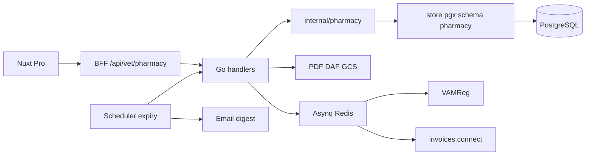

# 28 — Plan complet : stock cabinet & péremption

Plan d’implémentation pour la **gestion de stock médicamenteux** côté Pro (Nuxt), avec la **péremption** comme contrainte métier de premier plan.

- **Statut** : plan produit/tech — **décisions figées** (2026-07-27) — **non implémenté**
- **Socle réglementaire / architecture** : [27-PHARMACIE-BELGIQUE.md](27-PHARMACIE-BELGIQUE.md) (CNK, DAF, VAMReg, FEFO)
- **Ne pas confondre** avec les rappels Care côté Flutter (suivi patient, pas stock cabinet)
- **Références externes** (arbitrage §11) : Règlement (UE) 2019/6 · GDP vétérinaire (UE) 2021/1248 art. 24 FEFO · loi BE détention de médicaments périmés · AFMPS DAF (lot + n° AMM) · bonnes pratiques stock pharmacie 90/60/30

<details>
<summary><strong>Cadre légal géré par l’application</strong> (repliable)</summary>

Textes et obligations que le module pharmacie Pro couvre ou outille. À exposer aussi en UI Pro (`<details>` sous le header des pages `/medicaments`, `/stock`, `/daf`) via i18n `pharmacy.legal.*`.

| Thème | Surface app | Description |
|-------|-------------|-------------|
| **FEFO** | Sortie DAF · `AllocateFEFO` · preview wizard | Règlement d’exécution **(UE) 2021/1248 art. 24** (GDP médicaments vétérinaires) : rotation « first expiry, first out » ; exceptions documentées. Phase 1 = FEFO strict, pas d’override. |
| **Médicaments périmés** | Auto-quarantaine · blocage DAF/adjust · waste | Droit belge : détention / vente / délivrance de médicaments vétérinaires **périmés** sanctionnée. Dès `expires_on < today` (Europe/Brussels) → hors stock actif ; sortie uniquement via waste tracé. |
| **DAF — mentions** | Wizard · PDF GCS | **AFMPS** : n° de **lot** + n° **AMM** obligatoires (modèles sept. 2024+). La DLC n’est pas une mention légale du formulaire ; gérée en stock/FEFO, bonus PDF possible. |
| **Registres & conservation** | `stock_movements` · DAF gapless · `job_audit` | **(UE) 2019/6** + règles BE : traçabilité entrées/sorties ; conservation typique **5 ans** pour inspection AFMPS. |
| **Inventaire annuel** | Export CSV `/stock` · backlog inventaire guidé | Dépositaire : ≥ **1×/an** rapprochement registres ↔ stock physique, écarts consignés. |
| **Quarantaine & destruction** | `status=quarantine` · waste | Séparer physiquement périmés / retours / à détruire jusqu’à disposition. Logiciel = quarantaine auto ; destruction ou retour fournisseur = acte humain documenté. |
| **Antibiotiques / VAMReg** | DAF · worker Asynq | Champs VAMReg obligatoires si antibiotique ; finalize bloqué tant qu’incomplets. |

</details>

---

## 1. Problème à résoudre

Les cabinets vétérinaires gèrent des médicaments avec :

1. **Lots** (numéro de fabrication) et **dates de péremption** obligatoires.
2. Obligation pratique de sortir d’abord le lot qui expire le plus tôt (**FEFO**).
3. Risque clinique / légal si un produit **périmé** est administré ou fourni.
4. Coût : destruction / waste des lots proches ou dépassés ; besoin d’**anticiper** (alertes).
5. Multi-dépôts (frigo, salle de soins, voiture) avec des durées de vie différentes selon conservation.

PetsFollow doit couvrir le circuit **entrée → stockage → alerte → sortie contrôlée → DAF → destruction**, pas seulement un compteur de quantité.

---

## 2. Objectifs & non-objectifs

### Objectifs (MVP → Phase 1)

| ID | Objectif | Priorité |
|----|----------|----------|
| O1 | Dictionnaire médicaments BE (CNK) + recherche cabinet | P0 |
| O2 | Stocks multi-dépôts, lots, qty, `expires_on` | P0 |
| O3 | Sorties FEFO atomiques (concurrence sûre) | P0 |
| O4 | **Cycle de vie péremption** (seuils, blocages, waste) | P0 |
| O5 | Alertes & digests péremption (UI + email / notif Pro) | P0 |
| O6 | DAF + PDF + numérotation gapless | P1 |
| O7 | VAMReg + invoices.connect (workers) | P1 |

### Non-objectifs Phase 1

- UI Flutter client / stock propriétaire
- Facturation Stripe des lignes DAF
- Logiciel DAF « certifié » de remplacement légal
- Scan code-barres matériel (prévu Phase 1.1 optionnelle)
- Multi-practice / partage de stock inter-cabinets

---

## 3. Principes métier — péremption

### 3.1 Définitions

| Terme | Définition |
|-------|------------|
| `expires_on` | Date de péremption du **lot** (jour calendaire, timezone métier = **Europe/Brussels**) |
| **Périmé** | `expires_on < today` (Bruxelles) |
| **Critique** | `today ≤ expires_on ≤ today + warn_critical_days` (défaut **30**) |
| **À retourner** | `today + warn_critical_days < expires_on ≤ today + warn_return_days` (défaut **60**) |
| **Attention** | `today + warn_return_days < expires_on ≤ today + warn_soon_days` (défaut **90**) |
| **OK** | `expires_on > today + warn_soon_days` |
| **Quarantaine** | Lot bloqué (auto-périmé, rappel fabricant, chaîne du froid, suspicion) — **non sortible** |

Trois horizons d’alerte (**90 / 60 / 30**) = standard pharmacie : revue → retour fournisseur → retrait urgent du stock actif.

Seuils **par practice** (table `pharmacy.practice_settings`) :

| Paramètre | Défaut | Rôle |
|-----------|--------|------|
| `warn_soon_days` | 90 | Badge ambre — planifier usage / revue |
| `warn_return_days` | 60 | Badge orange — file retour fournisseur / reverse |
| `warn_critical_days` | 30 | Badge rouge — action urgente |
| `receipt_warn_days` | 30 | Soft-confirm à l’entrée si DLC ≤ N jours |
| `allow_expired_receipt` | `false` | Interdit d’entrer un lot déjà périmé |
| `block_expired_on_daf` | `true` | Interdit finalize si lot périmé |
| `block_expired_on_adjust_out` | `true` | Interdit sortie manuelle sur lot périmé (sauf waste) |
| `auto_quarantine_expired` | `true` | Job quotidien : périmé → `quarantine` (pas de destruction auto) |
| `expiry_digest_enabled` | `true` | Digest **hebdomadaire** (pas quotidien) |
| `expiry_digest_weekday` | `1` | 1 = lundi (ISO) · 07:00 Europe/Brussels |
| `notify_on_auto_quarantine` | `true` | Email événementiel si nouveaux lots auto-quarantaine |

### 3.2 États d’un lot

```text
active ──(péremption atteinte + job)──► quarantine ──(waste UI)──► depleted (qty=0, status=wasted)
   │                                         │
   └──(sortie FEFO / adjust)──► qty↓         └──(override admin rare)──► active (audit)
```

| `status` | Sortable FEFO ? | Visible stock ? |
|----------|-----------------|-----------------|
| `active` | oui si `expires_on >= today` et `qty > 0` | oui |
| `quarantine` | **non** | oui (filtre dédié) |
| `wasted` | non | historique / mouvements |

**Règle dure** : `AllocateFEFO` ne sélectionne que `status = active AND expires_on >= CURRENT_DATE AND qty_on_hand > 0`.

### 3.3 FEFO enrichi

**Obligation GDP UE 2021/1248 art. 24** : rotation « first expiry, first out » ; **toute exception doit être documentée**.

Phase 1 :

1. `expires_on ASC`
2. `created_at ASC` (stabilité)
3. Split multi-lots si qty insuffisante sur le premier
4. **Pas d’override FEFO** (pas de choix manuel d’un lot plus long) — évite les exceptions non auditées

UI wizard DAF : **preview FEFO** avant finalize (lots + dates + bandes 90/60/30).

Si stock « mathématiquement » suffisant mais uniquement en lots périmés / quarantaine → **409** `stock_unavailable_valid_lots`.

### 3.4 Entrée stock (receipt)

- `lot_number` + `expires_on` **obligatoires** (+ `medication_id` / CNK)
- **Hard block** si `expires_on < today` (`allow_expired_receipt=false`) — aligné interdiction BE de détenir/délivrer des périmés
- **Soft confirm** si `expires_on ≤ today + receipt_warn_days` (30) — questionner les lots court-datés (pratique clinique)
- Conservation : dépôt (ex. `FRIDGE`) — **BUD post-ouverture hors Phase 1** (`opened_at` backlog)

### 3.5 Sorties & waste

| Motif | Effet péremption |
|-------|------------------|
| `daf` | FEFO ; jamais lot périmé / quarantaine |
| `adjust` (−) | même garde-fou si `block_expired_on_adjust_out` |
| `waste` | **seul** chemin comptable pour sortir un lot périmé/quarantaine (destruction **ou** retour fournisseur) |
| `daf_cancel` | restock même `batch_id` si non administré ; sinon waste |

`waste_reason` : `expired` \| `supplier_return` \| `cold_chain` \| `damaged` \| `recall` \| `other`

- **Pas de waste automatique** : la destruction / retour exige un acte humain + motif (traçabilité inspection).
- Quarantaine logiciel ≠ déplacement physique : UI rappelle de **séparer physiquement** (zone quarantaine / destruction) — bonnes pratiques entreposage.

### 3.6 Alertes & digests

| Canal | Contenu | Fréquence |
|-------|---------|-----------|
| UI `/stock` | Compteurs + tri `expires_on` ; bandes 90/60/30/périmé/quarantaine | à chaque chargement |
| Badge nav « Stock » | Nb Critique + Quarantaine/Périmé | refresh page |
| Job `expiry-run` | Auto-quarantaine des lots `expires_on < today` encore `active` | **quotidien** 06:30 Europe/Brussels |
| Email événementiel | Nouveaux lots auto-quarantaine (si `notify_on_auto_quarantine`) | à chaque run qui mute ≥1 lot |
| Digest hebdo | Synthèse Attention / À retourner / Critique / Quarantaine | **lundi** 07:00 Europe/Brussels |
| (P1.1) | Notif in-app Pro | — |

Un seul endpoint interne (fusionné) :

```text
POST /api/v1/internal/pharmacy/expiry-run
Header: X-Pharmacy-Expiry-Secret  # secretHeaderOK
Body optionnel: { "forceDigest": true }
```

Comportement : (1) auto-quarantaine → (2) emails événementiels → (3) si weekday = digest weekday **ou** `forceDigest`, envoi digest (skip si tous compteurs à 0).

Scheduler GCP : `infra/gcp/setup-pharmacy-expiry-scheduler.sh` (cron quotidien).

### 3.7 Reporting péremption (MVP UI)

- Filtres : Tous / Attention / À retourner / Critique / Quarantaine / Dépôt
- Tri défaut : `expires_on ASC`
- Actions : quarantaine manuelle · waste (destruction / retour fournisseur)
- Export CSV (inventaire / contrôle annuel — AR belge : vérif registres ↔ stock **≥ 1×/an**)
- PDF DAF : **lot + n° AMM obligatoires** (AFMPS) ; `expires_on` **affichée en bonus** (non exigée sur le formulaire légal)

---

## 4. Architecture (rappel aligné sur 27)



- Feature flag : `PHARMACY_ENABLED`
- Isolation : tout scoppé `practice_id`
- Domaine : `go/internal/pharmacy/` (FEFO, expiry status, DAF number)
- Pas de JWT en JS client ; cookies httpOnly BFF inchangés

---

## 5. Modèle de données (extensions vs 27)

Réutiliser le schéma `pharmacy` de la doc 27, **plus** :

### 5.1 `pharmacy.practice_settings` (nouveau)

| Colonne | Type | Notes |
|---------|------|-------|
| `practice_id` | UUID PK | |
| `warn_soon_days` | INT | défaut 90 |
| `warn_return_days` | INT | défaut 60 |
| `warn_critical_days` | INT | défaut 30 |
| `receipt_warn_days` | INT | défaut 30 |
| `allow_expired_receipt` | BOOL | défaut false |
| `block_expired_on_daf` | BOOL | défaut true |
| `block_expired_on_adjust_out` | BOOL | défaut true |
| `auto_quarantine_expired` | BOOL | défaut true |
| `expiry_digest_enabled` | BOOL | défaut true |
| `expiry_digest_weekday` | INT | défaut 1 (lundi) |
| `notify_on_auto_quarantine` | BOOL | défaut true |
| `digest_user_ids` | UUID[] | nullable = tous vets practice |
| `updated_at` | TIMESTAMPTZ | |

### 5.2 `pharmacy.medication_batches` — colonnes ajoutées

| Colonne | Type | Notes |
|---------|------|-------|
| `status` | TEXT | `active` \| `quarantine` \| `wasted` |
| `quarantined_at` | TIMESTAMPTZ | nullable |
| `quarantine_reason` | TEXT | nullable |
| `wasted_at` | TIMESTAMPTZ | nullable |
| `waste_reason` | TEXT | `expired` \| `cold_chain` \| `damaged` \| `recall` \| `other` |

Index FEFO mis à jour :

```text
(practice_id, medication_id, deposit_id, expires_on ASC)
WHERE qty_on_hand > 0 AND status = 'active'
```

Index alertes :

```text
(practice_id, expires_on ASC)
WHERE qty_on_hand > 0 AND status IN ('active', 'quarantine')
```

### 5.3 `pharmacy.stock_movements` — `reason` étendu

`receipt` | `daf` | `adjust` | `waste` | `daf_cancel` | `quarantine` | `unquarantine`

Champ optionnel `reason_detail` TEXT.

### 5.4 Migrations (ordre)

| Migration | Contenu |
|-----------|---------|
| `0000XX_pharmacy_ref` | `ref_medications` + trgm |
| `0000XX_pharmacy_stock` | deposits, batches(+status), movements, practice_settings |
| `0000XX_pharmacy_daf` | sequences, documents, items |
| `0000XX_pharmacy_jobs_audit` | job_audit workers |

*(Numéros exacts = prochaines libres au moment du merge — ne pas figer 000039 si déjà pris.)*

---

## 6. API (surface stock + péremption)

Préfixe authentifié véto : `/api/v1/vet/pharmacy/…` (+ BFF Nuxt miroir).

| Méthode | Route | Rôle |
|---------|-------|------|
| GET | `/medications/search?q=` | Autocomplete CNK |
| GET/POST | `/deposits` | Dépôts |
| GET | `/batches?status=&expiry=&depositId=` | Liste lots + filtres péremption |
| POST | `/batches` | Receipt (lot + expires_on) |
| POST | `/batches/{id}/adjust` | Ajustement |
| POST | `/batches/{id}/quarantine` | Bloquer lot |
| POST | `/batches/{id}/waste` | Destruction / péremption |
| GET | `/movements` | Journal |
| GET | `/expiry/summary` | Compteurs OK / soon / critical / expired / quarantine |
| PATCH | `/settings` | Seuils + digest |
| … | DAF (voir 27) | |

Interne :

| Méthode | Route | Rôle |
|---------|-------|------|
| POST | `/internal/pharmacy/expiry-run` | Quarantaine auto + enqueue digests |
| POST | `/internal/pharmacy/expiry-digest/run` | Envoi digests (ou fusionné avec expiry-run) |

Erreurs métier stables (i18n) :

- `stock_insufficient`
- `stock_unavailable_valid_lots` (périmé/quarantaine uniquement)
- `batch_expired`
- `batch_quarantined`
- `invalid_expiry_on_receipt`

---

## 7. UX Pro

### Navigation (vet-only, si `PHARMACY_ENABLED`)

**Médicaments** · **Stock** · **DAF**

### `/stock`

1. Header : stats (Critique / Attention / À retourner / Périmé / Quarantaine)
2. **Bloc légal rétractable** (`<details class="pharmacy-legal">`) : cadre FEFO / périmés / inventaire (clés `pharmacy.legal.*`) — fermé par défaut
3. Toolbar : recherche, filtre dépôt, filtre bande péremption
4. Table lots : médicament, CNK, lot, dépôt, qty, `expires_on`, badge statut
5. Actions ligne : adjust · quarantine · waste
6. CTA « Entrée stock »

Même motif `<details>` (contenu filtré par page) sur `/medicaments` (CNK / antibiotiques) et `/daf` (mentions AFMPS lot+AMM, conservation 5 ans).

### `/stock/mouvements`

Journal filtrable (dont `waste` / `quarantine`).

### `/daf/nouveau`

Preview FEFO avec dates ; blocage finalize si ligne sans lot valide ; panneau antibiotique (27).

### i18n

Namespace `pharmacy.*` dans **fr / en / nl / es / et / it** (6 locales).

Clés péremption minimales :

- `pharmacy.expiry.ok|soon|return|critical|expired|quarantine`
- `pharmacy.expiry.digestSubject`
- `pharmacy.expiry.physicalSegregationHint`
- `pharmacy.errors.stockUnavailableValidLots`
- `pharmacy.waste.reasons.*`
- `pharmacy.legal.title` + `pharmacy.legal.fefo|expired|daf|records|inventory|quarantine|vamreg` (corps du bloc rétractable)

---

## 8. Plan d’exécution par sprints

Ordre strict. Chaque sprint a un critère **Done when**.

### Sprint 0 — Validation plan (0,5 j)

- Valider ce document + [27](27-PHARMACIE-BELGIQUE.md) (seuils 30/90, auto-quarantaine, digests).
- Décider : un job `expiry-run` fusionné vs deux endpoints.
- **Done when** : OK produit + tech ; flag `PHARMACY_ENABLED` acté.

### Sprint 1 — Dictionnaire CNK (3–5 j)

- Migration ref + CLI `import-cnk`
- API search + page `/medicaments` + `ProCombobox`
- **Done when** : import idempotent ; search &lt; 100 ms ; badge antibiotique

### Sprint 2 — Stock + péremption cœur (5–8 j) ← **critique**

- Migrations stock + `practice_settings` + status lots
- CRUD dépôts / receipt / adjust / waste / quarantine
- `AllocateFEFO` (ignore périmé & quarantaine) + tests concurrence
- UI `/stock` + summary expiry + filtres
- Job `expiry-run` (auto-quarantaine quotidienne) + digest hebdo + notify événementiel (dry-run OK)
- **Done when** :
  - 2 TX parallèles sans qty négative
  - lot périmé **jamais** sorti en DAF/adjust
  - waste seul chemin de sortie périmé (motifs incl. `supplier_return`)
  - bandes 90/60/30 visibles UI
  - expiry-run idempotent ; digest skip si vide
  - tests Go intégration sur bandeaux expiry

### Sprint 3 — DAF + PDF (5–8 j)

- Sequences gapless, draft/finalize/cancel, PDF GCS
- Wizard + preview FEFO daté
- **Done when** : finalize ACID ; 409 si seuls lots périmés ; PDF hashé

### Sprint 4 — Workers VAMReg (3–5 j)

- Asynq + audit + retry
- **Done when** : dry-run + failed→retry→failed terminal

### Sprint 5 — invoices.connect (3–5 j)

- Export asynchrone + webhook HMAC
- **Done when** : contrat JSON figé ; idempotence

### Sprint 6 — Durcissement & ops (2–3 j)

- Scheduler GCP expiry + secrets
- Smoke staging : receipt → alerte → waste → DAF happy path
- Maj `15-PLAN-TESTS.md` (P0 stock/péremption) + useCase commercial si démo
- **Done when** : checklist §10 verte sur staging pilote

---

## 9. Tests anti-régression (obligation)

| Couche | Cas péremption / stock |
|--------|------------------------|
| Unit Go | FEFO skip périmé ; split multi-lots ; seuils soon/critical |
| Intégration PG | finalize concurrent ; waste ; auto-quarantaine job |
| API | receipt expires_on passé → 400 ; DAF sur lot périmé → 409 |
| Worker/cron | expiry-run idempotent ; digest dry-run |
| E2E Playwright `@p0` (après UI) | Filtre Critique + waste + entrée stock |

Commandes : `make test-go` · smoke · `make test-e2e-p0` (quand pages prêtes).

---

## 10. Checklist ops (avant activation staging)

- [ ] Migrations pharmacy appliquées
- [ ] Import CNK exécuté
- [ ] `PHARMACY_ENABLED=true` (staging / cabinet pilote)
- [ ] Secrets : expiry digest + VAMReg + invoices (selon sprint)
- [ ] Scheduler `expiry-run` quotidien (Europe/Brussels)
- [ ] Redis joignable si workers activés
- [ ] GCS pour PDF DAF
- [ ] Smoke : entrée lot bientôt périmé → badge Critique → waste → entrée lot OK → DAF finalize

---

## 11. Décisions figées (validées + arbitrage web 2026-07-27)

### 11.1 Les 5 points validés (confirmés)

| # | Décision | Statut |
|---|----------|--------|
| 1 | Seuils d’alerte péremption | **Étendu** → **90 / 60 / 30** (voir 11.2) |
| 2 | Auto-quarantaine des lots périmés ON | **Confirmé** |
| 3 | Pas d’entrée stock déjà périmé | **Confirmé** (+ soft-warn ≤ 30 j) |
| 4 | Waste = seul chemin sortie comptable d’un périmé | **Confirmé** (inclut retour fournisseur) |
| 5 | Un job `expiry-run` | **Confirmé** (quotidien quarantaine ; digest **hebdo**) |

### 11.2 Ambiguïtés tranchées (sources)

| Ambiguïté | Décision retenue | Pourquoi |
|-----------|------------------|----------|
| 2 bandes (90/30) vs 3 (90/60/30) | **90 / 60 / 30** | Standard pharmacie : 90 revue, 60 retour fournisseur, 30 retrait urgent |
| Digests quotidiens vs hebdo | Job **quotidien** silencieux (quarantaine) + digest **lundi** + email si nouveaux auto-quarantaine | Évite le bruit ; revue clinique typiquement hebdo/mensuelle |
| Quarantaine auto vs waste auto | **Quarantaine auto uniquement** ; waste **manuel** | Entreposage : séparer jusqu’à disposition ; destruction documentée |
| Override FEFO (choisir un autre lot) | **Interdit Phase 1** | GDP UE 2021/1248 art. 24 : FEFO ; exceptions à documenter → pas d’exception sans audit dédié |
| Expiry sur le DAF PDF | Lot + **n° AMM** obligatoires ; `expires_on` **bonus UI/PDF** | Liste AFMPS DAF : lot + AMM, **pas** la DLC |
| Court-daté à la réception | Soft-confirm ≤ 30 j ; hard-block périmé | Pratique clinique « refuse/question short-dated » |
| Timezone | `Europe/Brussels` | Métier BE |
| BUD post-ouverture | **Hors Phase 1** | Complexité conservation / multi-dose |
| Inventaire annuel | Backlog P1.1 + export CSV dès S2 | AR belge : vérif registres ↔ stock ≥ 1×/an |
| Possession de périmés | Hors stock **actif** dès J+0 (quarantaine) | Loi BE : détention/délivrance de médicaments vétérinaires **périmés** sanctionnée |

### 11.3 Risques résiduels

| Risque | Mitigation |
|--------|------------|
| Digests bruyants | Skip si compteurs à 0 ; weekday configurable |
| Séparation physique oubliée | Copy UI « Séparer physiquement » à chaque passage quarantaine |
| Confusion Care vs stock | Libellés « Stock cabinet » ; pas de surface Flutter |
| Override admin receipt périmé | Flag `allow_expired_receipt` défaut OFF + audit log |

---

## 12. Backlog Phase 1.1+

- Scan code-barres / Datamatrix lot + expiry
- Beyond-use date après ouverture (`opened_at`)
- Lien fiche animal → historique DAF/médicaments
- Inventaire physique guidé (comptage annuel obligatoire BE)
- Seuils par dépôt ou par médicament (vaccins vs topiques)
- Intégration rappel fabricant (lot recall → quarantine mass)
- Override FEFO documenté (motif obligatoire) si besoin terrain
- Fenêtre crédit retour fournisseur (souvent 6–9 mois) — bande optionnelle 180 j

---

## 13. Liens

| Doc | Lien |
|-----|------|
| Spec pharmacie BE | [27-PHARMACIE-BELGIQUE.md](27-PHARMACIE-BELGIQUE.md) |
| Modules métier | [04-MODULES-METIER.md](04-MODULES-METIER.md) |
| Plan de tests | [15-PLAN-TESTS.md](15-PLAN-TESTS.md) |
| GCP | [10-GCP-DEPLOIEMENT.md](10-GCP-DEPLOIEMENT.md) |
| AFMPS — documents vétérinaires / DAF | https://www.afmps.be/fr/usage_veterinaire/medicaments/medicaments/distribution_et_delivrance/documents_veterinaires |
| GDP FEFO médicaments vétérinaires | Règlement d’exécution (UE) 2021/1248 art. 24 |

**Prochaine action** : démarrer **Sprint 1** (dictionnaire CNK) — décisions §11 figées.
