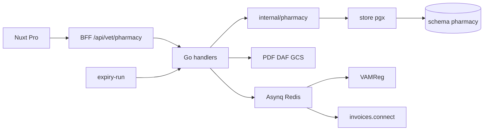

# 28 — Plan de mise en place : stock cabinet & péremption

**Objectif** : livrer la pharmacie cabinet Pro (Belgique) avec stock multi-dépôts, **péremption** (90/60/30), FEFO, DAF, workers.

| Méta | Valeur |
|------|--------|
| Statut global | **~90 % Phase 1** — S0–S4 ✅ · S5 ⏸ (reseller Billit) · S6 🟡 (~80 %) |
| Socle | [27-PHARMACIE-BELGIQUE.md](27-PHARMACIE-BELGIQUE.md) |
| Roadmap étendue | [37-ROADMAP-STOCK-FACTURATION.md](37-ROADMAP-STOCK-FACTURATION.md) (Phases 2–6 + Phase 0 partenaires) |
| Dernière revue | 2026-07-29 (S6 smoke staging ✅ après merge PR #3 + job `petsfollow-seed`) |
| Prochaine action | **S5** dès accès reseller Billit (**P0-2** — en attente, pas de code) ; Phase 2.F / 4.A–B / 4.E / Phase 5 attend P0 ; GA tag `dev` = décision produit |

Légende : ✅ fait · 🟡 partiel / prérequis réutilisable · ⬜ à faire · ❌ hors scope Phase 1

---

<strong>Cadre légal géré par l’application</strong> (repliable)

| Thème | Surface app | Description |
|-------|-------------|-------------|
| **FEFO** | Sortie DAF · `AllocateFEFO` · preview wizard | (UE) **2021/1248 art. 24** — rotation first expiry first out ; Phase 1 sans override |
| **Médicaments périmés** | Auto-quarantaine · blocage DAF/adjust · waste | Droit BE : détention/délivrance de périmés sanctionnée → hors stock actif dès J+0 |
| **DAF — mentions** | Wizard · PDF GCS | **AFMPS** : n° **lot** + n° **AMM** obligatoires ; DLC = bonus PDF |
| **Registres & conservation** | mouvements · DAF gapless · `job_audit` | (UE) **2019/6** + BE — traçabilité ; conservation typique **5 ans** |
| **Inventaire annuel** | Export CSV · backlog inventaire | ≥ **1×/an** registres ↔ stock physique |
| **Quarantaine & destruction** | `quarantine` · waste | Séparation physique ; waste **manuel** (destruction ou retour fournisseur) |
| **Antibiotiques / VAMReg** | DAF · worker Asynq | Finalize bloqué si payload incomplet |

---

## 0. Tableau de bord (contrôle 2026-07-28)

| Domaine | Avancement | Preuve / écart |
|---------|------------|----------------|
| Spec & décisions produit | ✅ | Docs 27 + 28 |
| Prérequis monorepo | ✅ | Redis/GCS/API · VAMReg dry-run sync + Asynq opt-in · PDF DAF GCS |
| Nav tag `dev` + `/medicaments` | ✅ | `layouts/default.vue` + `ProSidebar.tag` |
| Schéma SQL `pharmacy` | ✅ | `ref_medications` + stock + DAF + jobs/pricing/orders/inventory (`000107+`) |
| Search CNK (API + BFF + UI) | ✅ | Tests Go verts · `pg_trgm` staging OK |
| Stock / FEFO / péremption | ✅ | Store + API + `/stock` (composable + composants) + expiry-run |
| DAF / PDF + lien mouvements | ✅ | finalize/cancel écrivent `daf_id`+`daf_item_id` ; `GET /movements?dafId=` |
| Workers VAMReg / invoices.connect | 🟡 | VAMReg dry-run **sync** (défaut) ; Asynq opt-in `PHARMACY_WORKERS_ENABLED` ; invoices.connect = S5 gelé (P0-2) |
| Scheduler expiry | ✅ | `make gcp-pharmacy-expiry-scheduler` (04:00 Brussels) |
| Tests Go pharmacie | ✅ | Unit bands + FEFO + intégration stock/DAF/trace + VAMReg dry-run |
| Playwright P0 pharmacie | ✅ | `17-pharmacy-stock-daf.spec.ts` (@p0 @pharmacy) — quality CI ; hors post-deploy Cloud Run |
| Staging `PHARMACY_ENABLED` | ✅ | Défaut true si `APP_ENV=staging` (`deploy-run-args.sh`) + `VAMREG_DRY_RUN` |
| **Collision migration `000082`** | ⚠️ | Coexistent `000082_invoicing_billit` **et** `000082_pharmacy_ref_drop_unused_fts` — stock = **`000083+`** |
| Collision `000100`/`000101` pharmacie | ✅ | Chaîne pharmacie → **`000107`–`000112`** (visit/consultation gardent 100/101) |

**Progression par sprint (effort estimé Phase 1)**

| Sprint | Poids | Avancement | Contribution |
|--------|-------|------------|--------------|
| S0 Spec | 5 % | 100 % | 5 % |
| S1 CNK | 15 % | ~95 % | ~14 % |
| S2 Stock + péremption | 25 % | ~95 % | ~24 % |
| S3 DAF + PDF | 20 % | ~95 % | ~19 % |
| S4 VAMReg | 15 % | ~95 % | ~14 % |
| S5 invoices.connect | 10 % | 0 % (gelé) | 0 % |
| S6 Ops staging | 10 % | ~80 % | ~8 % |
| **Total** | 100 % | | **~90 %** |

---

## 1. Déjà fait (tracé)

### 1.1 Documentation & produit — ✅

| Livrable | Preuve |
|----------|--------|
| Spec architecture pharmacie BE | [27-PHARMACIE-BELGIQUE.md](27-PHARMACIE-BELGIQUE.md) |
| Plan stock + péremption + légal | ce document |
| Entrée index docs | [README.md](README.md) §27–28 |
| Mention module | [04-MODULES-METIER.md](04-MODULES-METIER.md) (« spec — non livré ») |
| Mention schéma | [03-MODELE-DONNEES.md](03-MODELE-DONNEES.md) (`pharmacy` = livré sous flag) |
| Décisions §11 figées | Seuils **90/60/30**, auto-quarantaine, waste manuel, FEFO strict, digest lundi, tag menu **dev** |
| Canvas plan | `plan-stock-peremption.canvas.tsx` |

### 1.2 Prérequis techniques déjà dans le monorepo — 🟡 (réemploi)

| Prérequis | État | Où |
|-----------|------|-----|
| API Go + `store` pgx + handlers | ✅ | `go/internal/` |
| Migrations jusqu’à `000080` | ✅ | Prochaine = **000081** (ne pas réutiliser 000039–000042 de la spec 27) |
| Nuxt Pro vet-only + BFF cookies httpOnly | ✅ | `nuxtjs/` |
| Redis (`REDIS_ADDR`) local + staging | ✅ | config / compose / deploy — **pas** Asynq |
| GCS médias / PDF pattern | ✅ | `platform/media` — kind `daf` à ajouter |
| Jobs internes + `secretHeaderOK` | ✅ | Pattern rétention / auth-health |
| Emails transactionnels i18n | ✅ | `notifications/email` |
| `ProSidebar` champ `tag` + pastille | ✅ | `ProSidebar.vue` — utilisé par `/invoicing` |
| i18n `nav.tagDev` = `dev` (6 locales) | ✅ | `nuxtjs/locales/*.json` |
| Rappels médicaments **client** (Care) | ✅ | Flutter — **hors** périmètre pharmacie cabinet |

### 1.3 Livré Sprint 1 (code) — ✅

| Livrable | Preuve |
|----------|--------|
| Migrations `000081_pharmacy_ref` (+ `000082_pharmacy_ref_drop_unused_fts`) | appliquées local |
| Table `pharmacy.ref_medications` | 3 CNK sample |
| `store/pharmacy_ref.go` + search | tests OK |
| `handlers/pharmacy_medications.go` | `GET /vet/pharmacy/medications/search` |
| CLI `import-cnk` + `make import-cnk` | `go/testdata/cnk_sample.csv` |
| Flag `PHARMACY_ENABLED` / `NUXT_PUBLIC_PHARMACY_ENABLED` | config + api-dev |
| Page `/medicaments` + `ProCombobox` + bloc légal | Nuxt |
| Nav Médicaments + tag `dev` | `default.vue` |
| i18n `pharmacy.*` | 6 locales |
| Review fixes (A11y `inputId`, Makefile paths, test CNK) | ✅ |

### 1.4 Livré Sprint 2 (code) — ✅ ~95 %

| Livrable | Preuve |
|----------|--------|
| Migration `000083_pharmacy_stock` | settings, deposits, batches(+status), movements |
| Domaine `go/internal/pharmacy` | bands 90/60/30, BrusselsToday, erreurs métier |
| Store FEFO + CRUD | receipt / adjust / quarantine / waste / AllocateFEFO |
| API vet stock + CSV | `handlers/pharmacy_stock.go` |
| Job `POST /internal/pharmacy/expiry-run` | `X-Pharmacy-Expiry-Secret` + digest lundi |
| BFF + page `/stock` + nav tag `dev` | Nuxt + i18n 6 locales |
| Tests | `pharmacy/domain_test`, `store/pharmacy_stock_test`, handlers stock |

### 1.5 Livré Sprint 3 (code) — ✅ ~95 %

| Livrable | Preuve |
|----------|--------|
| Migration `000084_pharmacy_daf` | sequences, documents, items |
| Finalize ACID + FEFO + gapless | `store/pharmacy_daf.go` |
| PDF gofpdf + media `daf/` (sensible) | `pharmacy/daf_pdf.go` |
| API + BFF + UI `/daf` · `/daf/nouveau` · `/daf/[id]` | tag `dev` |
| Gate antibiotique VAMReg | `pharmacy/vamreg.go` (worker = S4) |
| Tests | `TestPharmacyDAFFinalizeCancelPDF` + unit PDF/VAMReg |

### 1.6 Encore non démarré — ⬜

- Workers Asynq, VAMReg, invoices.connect
- Import AFMPS national complet
- Use case commercial `UC-*` pharmacie
- Activation staging Cloud Run (`PHARMACY_ENABLED` + `pg_trgm`)

---

## 2. Décisions métier figées (ne pas re-débattre)

| # | Décision | Statut |
|---|----------|--------|
| 1 | Seuils **90 / 60 / 30** j | ✅ |
| 2 | Auto-quarantaine ON (pas waste auto) | ✅ |
| 3 | Pas d’entrée déjà périmée + soft-warn ≤ 30 j | ✅ |
| 4 | Waste = seul chemin sortie (destruction **ou** `supplier_return`) | ✅ |
| 5 | Job `expiry-run` quotidien + digest **lundi** + mail si nouveaux quarantaine | ✅ |
| 6 | FEFO strict Phase 1 (pas d’override) | ✅ |
| 7 | Tag menu **`dev`** sur Médicaments / Stock / DAF | ✅ |
| 8 | Bloc légal `
` sur les 3 pages | ✅ |
| 9 | Timezone métier `Europe/Brussels` | ✅ |
| 10 | Numéros migration = **000081+** (spec 27 obsolète sur 000039–042) | ✅ (ce plan) |

Sources : (UE) 2019/6 · 2021/1248 art. 24 · AFMPS DAF · loi BE périmés · bonnes pratiques 90/60/30.

---

## 3. Architecture cible (rappel)

- Flag : `PHARMACY_ENABLED` (défaut `false`)
- Isolation : `practice_id`
- Nav : `tag: t('nav.tagDev')` sur les 3 entrées

---

## 4. Modèle de données (à créer)

Schéma `pharmacy` — détail colonnes : doc 27 + extensions péremption ci-dessous.

| Migration (cible) | Contenu | Statut |
|-------------------|---------|--------|
| `000081_pharmacy_ref` | `ref_medications` + `pg_trgm` | ✅ |
| `000082_pharmacy_ref_drop_unused_fts` | cleanup index FTS draft | ✅ (⚠️ même préfixe 000082 que Billit) |
| `000083_pharmacy_stock` | deposits, batches(+status), movements, `practice_settings` | ✅ |
| `000084_pharmacy_daf` | sequences, documents, items | ✅ |
| `000085_pharmacy_jobs_audit` | `job_audit` | ⬜ |

> **Attention** : `000082_invoicing_billit` coexiste déjà. Ne **pas** réutiliser `000082` pour le stock — démarrer à **`000083_pharmacy_stock`**.

**Bandes** : OK / Attention (90) / À retourner (60) / Critique (30) / Périmé / Quarantaine.

**FEFO** : `status=active AND expires_on >= today AND qty_on_hand > 0` ORDER BY `expires_on ASC`.

---

## 5. Plan d’exécution tracé (sprints)

### Sprint 0 — Spec & décisions — ✅ FAIT

| Tâche | Statut |
|-------|--------|
| Doc 27 + 28 + index | ✅ |
| Décisions péremption / FEFO / digests / tag `dev` / bloc légal | ✅ |
| Feature flag nommé `PHARMACY_ENABLED` (décision) | ✅ |
| Flag réellement branché dans config Go / Nuxt | ✅ |
| Extension Cloud SQL `pg_trgm` | ✅ — `medications/search` (ops `%` / `similarity`) HTTP 200 staging 2026-07-29 |

**Done when (restant)** : rien bloquant — passer Sprint 1.

---

### Sprint 1 — Dictionnaire CNK — ✅ ~95 %

| Tâche | Statut |
|-------|--------|
| Migration `000081_pharmacy_ref` | ✅ |
| CLI `import-cnk` (hors HTTP) + `make import-cnk` | ✅ |
| `PHARMACY_ENABLED` dans config + `.env.example` + `api-dev` | ✅ |
| API `GET …/medications/search` | ✅ |
| BFF + page `/medicaments` | ✅ |
| `ProCombobox` (+ A11y `inputId`) | ✅ |
| Nav `/medicaments` + tag **`dev`** + `data-testid` | ✅ |
| i18n `nav.medicaments` + `pharmacy.*` (6 locales) | ✅ |
| Bloc légal `
` (filtre CNK/antibiotiques) | ✅ |
| Tests search + import | ✅ |
| Import AFMPS national complet (fichier officiel) | ⬜ (échantillon local seulement) |

**Done when restant** : brancher un export AFMPS réel en staging (non bloquant pour S2).

---

### Sprint 2 — Stock + péremption — ✅ ~95 %

| Tâche | Statut |
|-------|--------|
| Migration **`000083_pharmacy_stock`** + `practice_settings` | ✅ |
| CRUD dépôts / receipt / adjust / quarantine / waste | ✅ |
| `AllocateFEFO` + lock `FOR UPDATE` (+ test FEFO) | ✅ (pas de test concurrence multi-goroutine dédié) |
| UI `/stock` + filtres 90/60/30 + summary | ✅ |
| Nav `/stock` + tag **`dev`** | ✅ |
| Bloc légal + hint séparation physique | ✅ |
| Job `POST /internal/pharmacy/expiry-run` + `secretHeaderOK` | ✅ |
| Digest hebdo + notify auto-quarantaine | ✅ (via `SendVetAlert`) |
| Export CSV | ✅ |
| Tests intégration péremption / receipt expiré | ✅ |
| Script scheduler GCP | ✅ `infra/gcp/setup-pharmacy-expiry-scheduler.sh` |

**Done when** : pas de sortie périmé ; waste seul chemin ; expiry-run idempotent ; bandes UI — **atteint** (scheduler GCP ✅).

---

### Sprint 3 — DAF + PDF — ✅ ~95 %

| Tâche | Statut |
|-------|--------|
| Migration **`000084_pharmacy_daf`** | ✅ |
| Draft / finalize / cancel + numérotation gapless | ✅ |
| PDF media local/GCS + sha256 | ✅ |
| Wizard `/daf/nouveau` + preview FEFO | ✅ |
| Nav `/daf` + tag **`dev`** | ✅ |
| Mentions PDF : lot + AMM (+ DLC bonus) | ✅ |
| Tests finalize / gapless / antibio / PDF / cancel | ✅ (pas de stress 2-TX dédié ; FEFO `FOR UPDATE` réutilisé) |

**Done when** : finalize ACID ; PDF accessible ; numéros monotones — **atteint**.

---

### Sprint 4 — Worker VAMReg — ✅ ~95 %

| Tâche | Statut |
|-------|--------|
| Migration **`000107_pharmacy_jobs_audit`** (ex-000100, évite collision `visit_soft_delete`) | ✅ |
| Dépendance Asynq + `internal/workers` | ✅ (opt-in `PHARMACY_WORKERS_ENABLED`) |
| Handler VAMReg + dry-run + retry | ✅ sync dry-run par défaut ; Asynq si workers ON |
| `PHARMACY_WORKERS_ENABLED` / `VAMREG_DRY_RUN` | ✅ |
| UI statut + retry `/daf/[id]` | ✅ |
| Tests | ✅ unit + `TestPharmacyDAFVAMRegDryRun` |

**Done when** : dry-run OK ; échec → retries → `failed` ; succès → `sent` — **atteint** (dry-run). API live = Phase 4.A / P0-1.

---

### Sprint 5 — invoices.connect — ⏸ **GELÉ** (accès reseller Billit)

> **Bloquant** : P0-2 dans [37-ROADMAP-STOCK-FACTURATION.md](37-ROADMAP-STOCK-FACTURATION.md). Ne pas démarrer BIL-9 / DAF→Billit tant que les credentials reseller ne sont pas en Secret Manager. Voir [33-BILLIT-INTEGRATION.md](33-BILLIT-INTEGRATION.md) § Phase 5.

| Tâche | Statut |
|-------|--------|
| Accès reseller Billit | 🟡 En attente |
| Gateway + task Asynq + webhook HMAC | ⏸ |
| Contrat JSON figé avec facturation | ⏸ |
| UI statut export | ⏸ |

**Done when** : reseller OK + mock/live HTTP vert ; idempotence `daf_id`.

---

### Sprint 6 — Ops staging & filet QA — 🟡 ~80 %

| Tâche | Statut |
|-------|--------|
| `setup-pharmacy-expiry-scheduler.sh` | ✅ |
| Flags staging `PHARMACY_ENABLED` (défaut true dans `deploy-run-args.sh`) | ✅ |
| Secrets SM + env Cloud Run (expiry) | ✅ |
| Env `VAMREG_DRY_RUN` + `PHARMACY_WORKERS_ENABLED` Cloud Run | ✅ (`deploy-run-args.sh`) |
| Secret optionnel `petsfollow-vamreg-api-key` → `VAMREG_API_KEY` | ✅ (branché si présent) |
| `pg_trgm` Cloud SQL | ✅ vérifié 2026-07-29 (search trigram staging OK) |
| Smoke staging pilote stock/DAF/VAMReg dry-run | ✅ MVP + `make smoke-pharmacy-s6-staging` (`vamregStatus=sent`, CNK demo) — seed via job Cloud Run `petsfollow-seed` (admin API seed reste ⛔ owner SQL) |
| Smoke DAF→Billit | ⏸ (après reseller) |
| Maj [15-PLAN-TESTS.md](15-PLAN-TESTS.md) P0 | ✅ C7.1–C7.15 + e2e `17-pharmacy-stock-daf` |
| Use case commercial + `make usecases-sync` | ✅ [UC-VP-05](../useCase/01-vetpro/UC-VP-05-pharmacie-stock-daf.md) |
| Option : retirer tag `dev` (ou flag) à la GA | ⬜ → Phase 6 ([37](37-ROADMAP-STOCK-FACTURATION.md)) |

**Done when (chemin stock)** : checklist §7 verte hors facture + smoke staging. Facture = hors done tant que reseller absent.

---

## 6. Surfaces API (à créer) — ⬜

Préfixe `/api/v1/vet/pharmacy/…` + BFF Nuxt.

| Zone | Routes clés | Statut |
|------|-------------|--------|
| Médicaments | `GET /medications/search` | ✅ |
| Dépôts / lots / mouvements | CRUD + adjust / quarantine / waste ; `GET /movements?dafId=` | ✅ |
| Expiry | `GET /expiry/summary` · `PATCH /settings` | ✅ |
| DAF | draft / finalize / cancel / PDF ; sorties liées `daf_id`+`daf_item_id` | ✅ |
| Interne | `POST /internal/pharmacy/expiry-run` | ✅ |

Erreurs i18n : `stock_insufficient` · `stock_unavailable_valid_lots` · `batch_expired` · `batch_quarantined` · `invalid_expiry_on_receipt`.

---

## 7. Checklist ops staging

- [x] Extension Cloud SQL **`pg_trgm`** disponible (créer une fois si migrate échoue)
- [ ] Migrations `000081`+ appliquées
- [ ] Import CNK exécuté
- [ ] `PHARMACY_ENABLED=true` (pilote)
- [ ] Nav Médicaments + tag **`dev`** visible
- [x] Secrets expiry (`PHARMACY_EXPIRY_SECRET` / `petsfollow-pharmacy-expiry-secret`)
- [x] Scheduler `expiry-run` (Europe/Brussels 04:00, `make gcp-pharmacy-expiry-scheduler`)
- [x] Env Cloud Run `VAMREG_DRY_RUN=true` · `PHARMACY_WORKERS_ENABLED=false` (sync)
- [ ] Secret `petsfollow-vamreg-api-key` (optionnel dry-run ; requis P0-1 live)
- [ ] Redis si `PHARMACY_WORKERS_ENABLED=true`
- [ ] GCS PDF DAF
- [ ] Smoke : receipt court-daté → badge → waste → lot OK → DAF finalize → VAMReg `sent` (dry-run)

---

## 8. Hors Phase 1 — voir roadmap étendue

Les items ci-dessous ne sont **plus** un fourre-tout « ❌ » : ils sont planifiés dans [37-ROADMAP-STOCK-FACTURATION.md](37-ROADMAP-STOCK-FACTURATION.md).

| Item | Où |
|------|-----|
| Prix catalogue, seuils réassort, **commandes e-mail + BL + inventaire** ✅, CNK national ⏸ P0-3 | Phase 2 ([37](37-ROADMAP-STOCK-FACTURATION.md) · 2.A–2.E livrés) |
| DAF → Billit auto, avoirs, reporting marge | Phase 3 (après reseller) |
| Stupéfiants, temps d’attente, chaîne alimentaire, VAMReg live | Phase 4 |
| Grossistes EDI, Bigame, Vetcompendium | Phase 5 |
| GA / retrait tag `dev` | Phase 6 |
| Flutter client / stock proprio | Care ≠ pharmacie (hors roadmap) |
| Stripe sur lignes DAF | Non (Billit) |
| Remplacement logiciel DAF certifié | Trajectoire P0-7 |

---

## 9. Risques

| Risque | Mitigation | Statut mitigation |
|--------|------------|-------------------|
| Digests bruyants | Skip si vide ; lundi only | ⬜ (à coder) |
| Séparation physique oubliée | Copy UI quarantaine | ⬜ |
| Confusion Care vs stock | Libellés « Stock cabinet » | ⬜ |
| Numéros migration 27 obsolètes | Ce plan impose **000081+** | ✅ |

---

## 10. Liens

| Doc | Lien |
|-----|------|
| Spec détaillée | [27-PHARMACIE-BELGIQUE.md](27-PHARMACIE-BELGIQUE.md) |
| Roadmap Phases 0–6 | [37-ROADMAP-STOCK-FACTURATION.md](37-ROADMAP-STOCK-FACTURATION.md) |
| Billit / BIL-9 | [33-BILLIT-INTEGRATION.md](33-BILLIT-INTEGRATION.md) |
| Modules | [04-MODULES-METIER.md](04-MODULES-METIER.md) |
| Modèle | [03-MODELE-DONNEES.md](03-MODELE-DONNEES.md) |
| Tests | [15-PLAN-TESTS.md](15-PLAN-TESTS.md) |
| GCP | [10-GCP-DEPLOIEMENT.md](10-GCP-DEPLOIEMENT.md) |
| AFMPS DAF | https://www.afmps.be/fr/usage_veterinaire/medicaments/medicaments/distribution_et_delivrance/documents_veterinaires |

**Prochaine action concrète** : **S6** smoke staging pilote (checklist §7, stock/DAF/VAMReg dry-run) ; **S5 / BIL-9** dès accès reseller Billit (P0-2).
