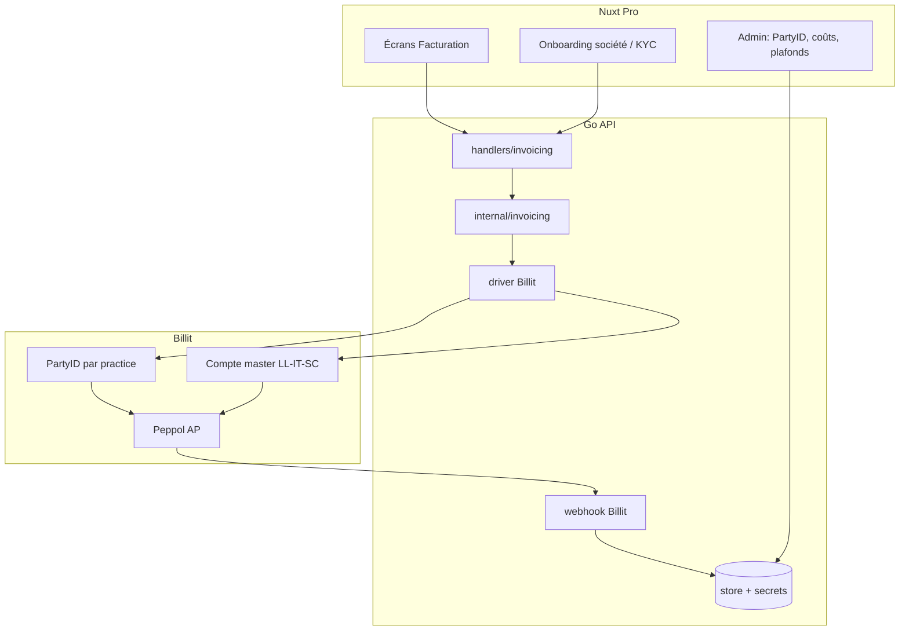

# 33 — Plan d’implémentation Billit (facturation Peppol)

**Statut** : **socle livré** (mock T0/T1 + client live + multi-pays + webhook durci) — pilote sandbox Billit ops ; Flux A SaaS = **opt-in + brouillon + envoi Peppol master** + cron C1 draft-only bouclé (`saas-targets` / `saas-invoices/run` ; smoke `make billit-saas-master-smoke` ; pas encore send auto).  
**Décisions produit figées** (sessions 2026-07) :

| Décision | Choix |
|----------|--------|
| Fournisseur Peppol | **Billit** (API + Access Point) |
| Prix Pro | **88 € HT/mois tout compris** (plus de module facturation séparé) |
| Setup | 320 € HT (inchangé sauf revue commerciale) |
| Comptes | **1 PartyID Billit / cabinet** (BCE/TVA) |
| Payeur Billit | **LL-IT-SC** (`Invoice to` = Integration Partner) |
| UX | Facturation **dans Pro** (Billit invisible au quotidien) |
| Contreparties | Identifiants fiscaux **BE / FR / IT / ES** mappés vers Billit `Identifiers` |
| Hors scope | Remplacer un PMS (Pégase…) ; Peppol sur abos animaux Stripe (B2C) |
| Lien futur | Driver Billit = implémentation concrète de `invoices.connect` ([27](27-PHARMACIE-BELGIQUE.md)) |

Réfs : [07-STRIPE-BILLING](07-STRIPE-BILLING.md) · [17-POLITIQUE-TARIFAIRE](17-POLITIQUE-TARIFAIRE.md) · [22-FICHE-PRODUIT-COMMERCIAL](22-FICHE-PRODUIT-COMMERCIAL.md) · [27-PHARMACIE](27-PHARMACIE-BELGIQUE.md) · **technique reseller** → [34-BILLIT-RESELLER-TECH](34-BILLIT-RESELLER-TECH.md).

---

## 1. Objectifs

1. **Conformité LL-IT-SC** : émettre les factures SaaS Pro (88 € + setup) en Peppol vers les cabinets assujettis BE.
2. **Valeur cabinet** : permettre au cabinet d’émettre factures / notes de crédit (et devis/pro forma hors Peppol) **depuis petsFollow**, au nom du cabinet.
3. **Transparence client** : une seule facture petsFollow ; aucun abonnement Billit visible côté cabinet.
4. **Architecture durable** : adaptateur `InvoicesConnect` avec driver `billit` (réutilisable pharmacie / DAF).

### Non-objectifs (v1)

- Moteur fiscal maison (UBL, numérotation légale complexe hors Billit).
- Réception Peppol achats cabinet (peut venir en v1.1 via même compte).
- Connecteurs natifs Pégase / Mammouth / Exact.
- Self-billing commissions.

### Contreparties multi-pays (BE / FR / IT / ES)

Les factures cabinet → client portent les identifiants exigés par le réseau e-facturation du pays du **client** (mappés côté API vers Billit `Customer.Identifiers`) :

| Pays | Identifiants |
|------|----------------|
| **BE** | N° TVA (BCE optionnel en UI) |
| **FR** | SIRET / SIREN (Factur-X / PA / Chorus) |
| **IT** | Partita IVA + **Codice Destinatario** (7 car.) **ou** PEC (SDI) — exclusifs |
| **ES** | NIF/CIF et/ou TVA |

Détail technique : [34](34-BILLIT-RESELLER-TECH.md).

---

## 2. Architecture cible



### Principes

| Principe | Détail |
|----------|--------|
| Multi-tenant | Tout scoppé `practice_id` |
| Secrets | `billit_api_key` hors DB claire (Secret Manager / vault chiffré) ; jamais au JS |
| Idempotency | Clé stable par document métier (`invoice_id` / `daf_id`) |
| Émetteur légal Flux C | Toujours le **cabinet** (UBL Party = practice) |
| Émetteur Flux A | **LL-IT-SC** (compte master) |
| Stripe | Inchangé (B2C animal) |

### Trois flux comptables (ne pas fusionner)

| Flux | Qui → qui | Outil |
|------|-----------|--------|
| **A** | LL-IT-SC → cabinet (SaaS 88 €) | Billit master |
| **B** | Billit → LL-IT-SC (licences PartyID) | Facture globale partner |
| **C** | Cabinet → ses clients | Billit PartyID practice via Pro |

---

## 3. Phases d’implémentation

### Phase 0 — Prérequis commerciaux & légaux (bloquant)

**Durée estimée** : 1–3 semaines (dépend Billit).  
**Owner** : direction + comptable.

| # | Livrable | Done when |
|---|----------|-----------|
| 0.1 | Compte Billit master LL-IT-SC | BCE/TVA OK, Peppol ID actif |
| 0.2 | Statut **Integration Partner** + **Reseller link** | Lien `my.billit.be/account/…/Register` reçu |
| 0.3 | Accord **Invoice to = partner** | Écrit ; facture test consolidée |
| 0.4 | Grille Billit (prix/PartyID, plafond docs, overage) | Chiffrage marge vs 88 € |
| 0.5 | CGV petsFollow | Service e-invoicing inclus ; émetteur = cabinet ; plafond X docs/mois ; DPA sous-traitant Billit |
| 0.6 | Validation fiscale « prestataire technique » | Note comptable / avocat (pas commissionnaire de vente) |
| 0.7 | Décision catalogue | Mettre à jour [17](17-POLITIQUE-TARIFAIRE.md) + [22](22-FICHE-PRODUIT-COMMERCIAL.md) + locales `products.*` → **88 € HT** |

**Gate** : pas de code prod Flux C tant que 0.2 + 0.3 ne sont pas signés.

---

### Phase 1 — Flux A uniquement (LL-IT-SC facture les cabinets)

**Durée** : ~1 semaine ops (+ éventuel script léger).  
**But** : conformité Peppol **émetteur plateforme** sans UI cabinet.

| # | Travail | Notes |
|---|---------|--------|
| 1.1 | Admin `/admin/invoicing` : brouillon + envoi Peppol master (`saas-draft` / `…/send`) | Code livré (mock) ; live = `BILLIT_MASTER_*` + smoke |
| 1.2 | Checklist onboarding cabinet : données société complètes | Réutilise profil payout (`vat_number`, `company_number`, adresse) |
| 1.3 | Export mensuel cabinets actifs → file d’émission | CSV admin `/admin/payments` ou nouveau export |
| 1.4 | Doc ops interne | Qui émet, quand, relances |

**Optionnelle** : cron `POST /internal/saas-invoices/run` (C1 draft-only, livré) — send Peppol auto (C2) **pas** prioritaire tant que le send manuel admin n’est pas prouvé en sandbox.

**Done when** : au moins une facture SaaS Peppol réelle émise et acceptée par un cabinet pilote.

---

### Phase 2 — Socle technique (adaptateur + modèle)

**Durée** : ~2–3 semaines dev.  
**But** : infrastructure réutilisable, sandbox Billit.

#### 2.1 Packages Go

```text
go/internal/invoicing/
  domain.go          # Invoice, CreditNote, ProForma, Line, Status
  service.go
  gateway.go         # interface InvoicesGateway
  billit/
    client.go        # HTTP v1/orders, send, webhooks
    map.go           # domain ↔ Billit Order JSON
  mock/
    gateway.go       # BILLIT_MOCK_ENABLED
```

Interface minimale :

```go
type InvoicesGateway interface {
  EnsureParty(ctx context.Context, practice PracticeParty) (partyID string, err error)
  CreateDocument(ctx context.Context, partyID string, doc Document) (externalID string, err error)
  SendPeppol(ctx context.Context, partyID string, externalID string) error
  GetStatus(ctx context.Context, partyID string, externalID string) (Status, error)
}
```

#### 2.2 Schéma DB (migration)

Schéma suggéré `invoicing` (ou `billing` étendu) :

| Table | Rôle |
|-------|------|
| `invoicing.practice_connections` | `practice_id`, `billit_party_id`, `status` (`pending_kyc`/`active`/`suspended`), `docs_included_monthly`, timestamps |
| `invoicing.documents` | `id`, `practice_id`, `type` (`invoice`/`credit_note`/`proforma`), `number`, `status`, `billit_order_id`, `idempotency_key`, `counterparty_json`, `totals`, `sent_at`, `peppol_status` |
| `invoicing.document_lines` | lignes (description, qty, unit_price_excl, vat_pct, cnk optionnel) |
| `invoicing.webhook_events` | audit raw + processed_at |
| `invoicing.usage_monthly` | `practice_id`, `yyyymm`, `doc_count` (pilotage plafond) |

Secrets API : **pas** en clair dans Postgres — référence Secret Manager `petsfollow-billit-practice-{id}` ou envelope encryption (`BILLIT_SECRETS_KEY`).

#### 2.3 Config env

```bash
BILLIT_ENABLED=false
BILLIT_MOCK_ENABLED=true          # local / CI
BILLIT_BASE_URL=https://api.billit.be   # confirmer sandbox URL Billit
BILLIT_MASTER_PARTY_ID=
BILLIT_MASTER_API_KEY=            # SM
BILLIT_WEBHOOK_SECRET=            # SM
BILLIT_RESELLER_REGISTER_URL=     # lien partner
BILLIT_DEFAULT_DOCS_INCLUDED=50
INVOICING_SAAS_PRICE_EUR_CENTS=8800
```

#### 2.4 Handlers / BFF

| Méthode | Route Go | BFF Nuxt | Auth |
|---------|----------|----------|------|
| GET | `/practices/me/invoicing/connection` | `/api/invoicing/connection` | vet |
| POST | `/practices/me/invoicing/connect` | idem | vet (démarre reseller / EnsureParty) |
| GET/POST | `/practices/me/invoicing/documents` | `/api/invoicing/documents` | vet |
| POST | `/…/documents/{id}/send` | send | vet |
| POST | `/…/documents/{id}/credit-note` | | vet |
| POST | `/webhooks/billit` | (direct Go ou BFF raw) | signature |
| GET | `/admin/invoicing/connections` | admin | admin |
| GET | `/admin/invoicing/usage` | admin | admin |

Pattern secrets internes : `secretHeaderOK` si endpoint cron d’usage.

#### 2.5 Tests Phase 2

- Unit map domain ↔ Billit JSON  
- Mock gateway + store integration (`newTestAPI`)  
- Webhook HMAC reject/accept  

**Done when** : `BILLIT_MOCK_ENABLED=true` : créer facture + « send » + statut dans tests verts ; sandbox Billit smoke manuel sur 1 PartyID.

---

### Phase 3 — UX Pro (transparence cabinet)

**Durée** : ~2–3 semaines.  
**But** : le cabinet facture sans quitter petsFollow.

#### 3.1 Parcours onboarding

Page `/settings/invoicing` (ou section `/settings`) :

1. Vérifier profil société (TVA, BCE, adresse) — deep-link profil incomplet  
2. Consentement CGU module e-invoicing  
3. CTA « Activer la facturation électronique » → reseller embed / redirect / API EnsureParty  
4. Statut : `En attente` → `Actif` (polling ou webhook)

#### 3.2 Parcours documents

| Écran | Contenu |
|-------|---------|
| Liste | Filtres type/statut, badge Peppol |
| Création | Client (carnet clients existant), lignes, TVA 6/21, aperçu totaux |
| Détail | PDF human-readable (Billit ou généré), timeline statuts |
| Actions | Envoyer Peppol, créer avoir, dupliquer, pro forma (PDF only) |

Design system : composants `Pro*` existants — **pas** d’iframe MyBillit en routine.

#### 3.3 i18n

Clés `invoicing.*` dans les **6** locales Nuxt (+ emails si notifs).

#### 3.4 Tests

- Playwright `@p0` ou `@p1` : activer connexion mock + créer draft + send mock  
- Maj [15-PLAN-TESTS](15-PLAN-TESTS.md) section facturation  
- Use case commercial : nouveau `UC-*-facturation` + `make usecases-sync` si parcours démo

**Done when** : pilote 2–3 cabinets sandbox/prod contrôlée ; zéro facture Billit reçue par le cabinet.

---

### Phase 4 — Ops, marge, plafonds

**Durée** : ~1 semaine.

| # | Livrable |
|---|----------|
| 4.1 | Dashboard admin usage docs / mois / practice |
| 4.2 | Alerte si `doc_count > docs_included` (email ops + badge Pro) |
| 4.3 | Process mensuel : facture Billit consolidée → allocation comptable |
| 4.4 | Runbook : KYC rejeté, Peppol reject, rotation API key |
| 4.5 | Feature flag `BILLIT_ENABLED` staging puis prod |

**Done when** : un mois complet piloté avec tableau marge (coût Billit vs 88 €).

---

### Phase 5 — Branche pharmacie / DAF (BIL-9) — **go dès accès reseller**

> **Statut** : ⏸ **gelé** jusqu’aux accès **reseller Billit** (Phase 0 / P0-2).  
> Pas de date fixe — démarrer S5 pharmacie + [37 Phase 3](37-ROADMAP-STOCK-FACTURATION.md) **immédiatement** après credentials SM + env staging.  
> Suivi stock : [28 Sprint 5](28-PLAN-STOCK-PEREMPTION.md) · roadmap [37](37-ROADMAP-STOCK-FACTURATION.md).

Quand reseller OK **et** [27](27-PHARMACIE-BELGIQUE.md) / DAF opérationnels :

- Worker Asynq `invoices.connect` → **même** `InvoicesGateway` Billit  
- Payload DAF → lignes document (prix côté catalogue practice ou saisie)  
- Idempotency = `daf_id`

Ne pas dupliquer un second client HTTP Billit.

---

## 4. Modèle de données (domaine)

```text
Document
  type: invoice | credit_note | proforma
  status: draft | issued | sending | delivered | rejected | cancelled
  peppolRequired: true pour invoice/credit_note B2B BE ; false pour proforma
  counterparty: { name, vat, address, peppolId? }
  lines[]: { description, qty, unitPriceExcl, vatPercent, meta }
  references: { relatedInvoiceId? }  # pour NC
```

Règles :

- **Pro forma** : jamais `SendPeppol` ; PDF / email only.  
- **Credit note** : liée à une facture émise ; montants cohérents.  
- **Numérotation** : préférer la numérotation Billit / config Party ; si double numérotation petsFollow, figer une seule source de vérité (décision Phase 2 — **recommandation : Billit**).

---

## 5. Sécurité & RGPD

| Sujet | Mesure |
|-------|--------|
| JWT | Inchangé (cookies httpOnly BFF) |
| Clés Billit | Secret Manager ; rotation runbook |
| Webhook | HMAC / secret temps constant (`secretHeaderOK` pattern) |
| PHI | Lignes médicaments = données santé → même discipline que DAF ; pas de log body complet |
| Export / purge | Export Pro : docs `created_by` ; anonymisation Pro : `created_by` → NULL + purge `connect_states` ; webhooks > 90 j purgés ; docs `sending` > 7 j → `rejected` (`stale_timeout`) |
| Erreurs gateway | `ErrGateway` → HTTP 502 (`invoicing_gateway_error`) |
| Webhook idempotence | clé = `EventID` Billit ou `sha256(body)` (pas order seul) — progression de statut appliquée |
| CSP | Pas de script Billit tiers ; API server-side only |
| Sous-traitance | DPA Billit + mention CGV |

---

## 6. Découpage tickets (suggestion backlog)

| ID | Titre | Phase | Estim. |
|----|-------|-------|--------|
| BIL-0 | Contrat partner Billit + CGV + prix 88 € docs | 0 | ops |
| BIL-1 | Ops Flux A MyBillit master | 1 | 3 j |
| BIL-2 | Migration `invoicing.*` + store | 2 | 3 j |
| BIL-3 | Client Billit + mock + map | 2 | 5 j |
| BIL-4 | Handlers + BFF + webhook | 2 | 5 j |
| BIL-5 | UI connexion + liste/création documents | 3 | 8 j |
| BIL-6 | NC + pro forma + statuts Peppol | 3 | 5 j |
| BIL-7 | Admin usage + alertes plafond | 4 | 3 j |
| BIL-8 | Tests Go + Playwright + plan tests + UC | 3–4 | 5 j |
| BIL-9 | Driver DAF → Billit | 5 | **Bloqué** : accès reseller ; puis avec pharmacie S5 |

**Total ordre de grandeur** (hors Phase 0 & 5) : **~6–8 semaines** 1 dev senior à temps plein, après signature partner / reseller.

---

## 7. Critères d’acceptation globaux

- [ ] Cabinet pilote : crée et envoie une facture Peppol **sans** compte MyBillit au quotidien  
- [ ] Cabinet pilote : **ne reçoit pas** de facture Billit (Invoice to = LL-IT-SC)  
- [ ] LL-IT-SC : émet SaaS 88 € en Peppol (Flux A) — **code admin OK (mock)** ; smoke sandbox live restant  
- [ ] Admin : voit usage docs et connexions  
- [ ] `BILLIT_MOCK_ENABLED` : CI verte sans appels externes  
- [ ] Docs tarifaires + locales + useCase alignés 88 €  
- [ ] Plafond docs documenté en CGV et appliqué (alerte)

---

## 8. Risques & mitigations

| Risque | Impact | Mitigation |
|--------|--------|------------|
| Billit refuse Invoice to partner | Modèle 88 € transparent cassé | Gate Phase 0 ; fallback add-on visible ou autre AP |
| Volume docs >> inclus | Marge négative | Plafond + alerte + upsell exception |
| KYC cabinet lent | Activation bloquée | Statuts clairs + support runbook |
| Double outil (Pégase + petsFollow) | Confusion | Pitch complément ; pas de promesse « remplace PMS » |
| Mapping TVA incorrect | Rejet Peppol / fiscal | Catalogue taux ; revue comptable pilote |
| Fuite API keys | Sécurité | SM + audit + least privilege |

---

## 9. Ordre de mise en production recommandé

```text
1. Phase 0 signée
2. Staging : BILLIT_ENABLED + sandbox, 1 practice seed
3. Phase 1 Flux A (prod LL-IT-SC) — valeur conformité immédiate
4. Phase 2–3 staging → pilote 2 cabinets
5. Feature flag prod progressive
6. Phase 4 un mois puis généralisation
7. Phase 5 (BIL-9) dès accès reseller + pharmacie S5
```

---

## 10. Actions immédiates (cette semaine)

1. Créer compte Billit LL-IT-SC.  
2. Envoyer / relancer la demande **Integration Partner + Reseller + Invoice to partner** — **bloque BIL-9**.  
3. Figer avec le comptable : plafond docs inclus dans les 88 €.  
4. Brouillon CGV e-invoicing.  
5. Exécuter la **checklist sandbox** de [34 § checklist A–F](34-BILLIT-RESELLER-TECH.md) dès R2–R5 obtenus (ne pas attendre l’UI admin).  
6. Gate : 1 facture BE `delivered` + webhook HMAC OK avant tout pilote multi-cabinets.  
7. Dès reseller reçu : débloquer S5 / BIL-9 + [37 Phase 3](37-ROADMAP-STOCK-FACTURATION.md) (pas de date fixe).

---

## 11. Suivi

| Champ | Valeur |
|-------|--------|
| Doc | `documentation/33-BILLIT-INTEGRATION.md` |
| Créé | 2026-07-27 |
| Prochaine revue | Après réponse Billit **reseller** (Phase 0 / P0-2) |
