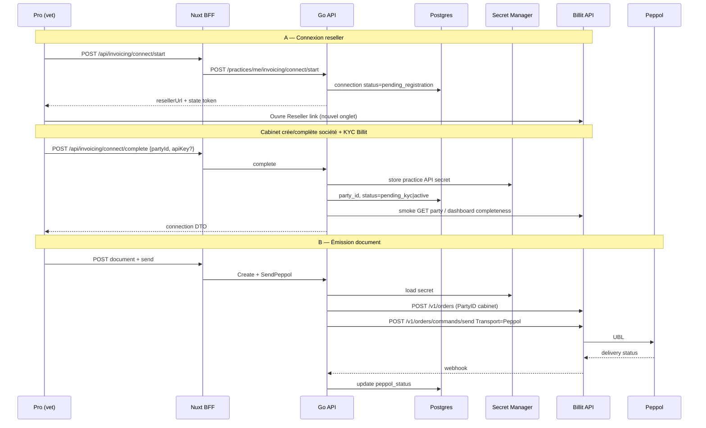

# 34 — Plan technique Billit reseller (petsFollow)

**Statut** : plan technique — **socle livré** (mock + client live + multi-pays + webhook durci, 2026-07-28). Prochaine étape : **pilote sandbox** (checklist ci-dessous).  
**Complète** : [33-BILLIT-INTEGRATION.md](33-BILLIT-INTEGRATION.md) (produit / phases / CGV).  
**Ce doc** = mise en place **technique** du mode **Integration Partner / Reseller** : 1 PartyID par cabinet, facturation Billit → LL-IT-SC, UI Pro transparente.

**Livré dans le monorepo** :
- Migrations `000085_invoicing_billit` + `000089_invoicing_webhook_idempotency` + `000094_invoicing_billit_order_unique` + `000097_invoicing_saas_source`
- `go/internal/invoicing` (domain multi-pays, service, secrets, gateway) + `invoicing/billit` (client HTTP, models, mapper, webhook) + `mock/`
- `store/invoicing.go` + handlers (`invoicing.go`, `invoicing_webhook.go`) + BFF `/api/invoicing/**`
- Page Pro `/invoicing` (tag `dev`) — connect + formulaire contrepartie BE/FR/IT/ES
- Webhook public `POST /api/v1/invoicing/webhooks/billit` (HMAC-SHA256 hex, header `X-Billit-Signature` ou `X-Signature`)
- Tests : totaux / seal / `ValidateCounterparty` / mapper pays / client `httptest` / `CheckParty` complétude / webhook parse+intégration (`TestInvoicingWebhook*`) / `TestValidateBillit*` / mock connect+send
- `make api-dev` : `BILLIT_ENABLED=true` + `BILLIT_MOCK_ENABLED=true` (opt-in ; **off** par défaut hors Make)
- Garde-fous : `ValidateBillit()` exige `BILLIT_BASE_URL` + `BILLIT_WEBHOOK_SECRET` en live ; refuse `plain_dev` hors `DEV_SEED` ; create + claim send atomiques + plafond docs
- Send **live** → statut `sending` ; `delivered` + usage mensuel via webhook (mock reste synchrone)
- Transport send : `Peppol` sauf **IT** (Identifiers SDI, Transport omis)
- Durcissements : retry HTTP **GET only** ; CheckParty fail-closed ; webhook rate-limit 120/min ; statut inconnu → `sending`
- Idempotence webhook : `EventID`/`eventId` uniquement (pas `Id` order) ou `sha256(body)` ; **re-apply** aussi sur duplicate (filet si Forget a échoué) ; persist order avant Peppol + restore claim si échec ; mock delivered+usage atomique ; `sending` > 7 j → `rejected` (job rétention) ; connect = Assert → CheckParty → Consume+Upsert **même TX** ; `billit_order_id` unique (mig 000094) + mock UUID

### Gap analysis (code vs objectifs T* / prérequis R*)

| ID | Attendu | Code | Écart |
|----|---------|------|-------|
| T1 | Lier Party via reseller | `connect/start` + URL + `complete` | Callback OAuth Billit absent — saisie manuelle PartyID/clé |
| T2 | Secret hors JS | `SealAPIKey` + `HasAPISecret` only | OK ; rotation = re-complete |
| T3 | Invoice to = partner | `invoice_to_partner` + `MarkPartnerListed` | Ops Billit + **UI** `/admin/invoicing` + API |
| T4 | Invoice / CN / Proforma | create + send + mapper multi-pays | OK mock ; **sandbox live non prouvée** |
| T5 | Statuts Peppol | webhook HMAC + apply + stale 7 j | **Pas de poll** ; URL webhook doit être joignable |
| T6 | Mock CI | `BILLIT_MOCK_ENABLED` + Playwright skip-safe | OK |
| R1 | Master LL-IT-SC | env `BILLIT_MASTER_*` + `CreateSaasDraft` | **MVP draft** (mock defaults ; live = env) |
| R2 | Reseller link | `BILLIT_RESELLER_REGISTER_URL` | OK (config) |
| R3 | Invoice to partner | runbook §12 | Process manuel |
| R4–R5 | Sandbox API + webhook | client + handler | Gate **smoke** ci-dessous |
| R6 | Clé multi-Party | header `PartyID` sur chaque call | OK côté client |
| BIL-7 | Admin usage / alertes | UI `/admin/invoicing` | KPI overdue partner (>7 j) + quota ≥80 % + **CSV** pending ; pas d’email auto |
| BIL-9 | DAF → lignes facture | CTA query + `visitId` | **Pas** de mapping lignes DAF |
| NC parent | `relatedDocumentId` obligatoire (API + UI select) | OK |
| Flux A | Facture SaaS 88 € | `saas-draft` + `saas-documents/…/send` | **Draft + send** mock ; live = webhook |

### Checklist sandbox Billit (ops — exécuter dans l’ordre)

**Automatisation** : `make api-billit-live` (API mock off) puis `make billit-sandbox-smoke`  
(`scripts/smoke-billit-sandbox.sh` — refuse si `BILLIT_MOCK_ENABLED=true`).  
Option send live : `BILLIT_SMOKE_PARTY_ID` + `BILLIT_SMOKE_API_KEY`. Suite UI/webhook delivered = manuelle (D–F).

**A. Prérequis Billit (hors repo)**

1. Compte sandbox Integration Partner + 1 Party cabinet test + clé API user multi-Party.  
2. Secret webhook fourni par Billit (ou choisi et enregistré des deux côtés).  
3. URL publique API (staging Cloud Run **ou** tunnel local vers `:8291`).

**B. Config runtime**

```bash
# Exemple local live (pas mock) — NE PAS utiliser le défaut mock de api-dev
export BILLIT_ENABLED=true
export BILLIT_MOCK_ENABLED=false
export BILLIT_BASE_URL=https://api.billit.be   # ou URL sandbox doc Billit
export BILLIT_WEBHOOK_SECRET='…'               # même valeur chez Billit
export BILLIT_SECRETS_BACKEND=local_enc
export BILLIT_SECRETS_KEY='…'                  # ≥ 16 chars aléatoires
export BILLIT_RESELLER_REGISTER_URL='https://my.billit.be/account/…/Register'
export DEV_SEED_ENABLED=true                   # local only
export NUXT_PUBLIC_BILLIT_ENABLED=true
# Option A (recommandée) : make api-billit-live
# Option B : process API dédié (même env que ci-dessus)
# Option C : BILLIT_MOCK_ENABLED=false make api-dev
make billit-sandbox-smoke
# Avec Party sandbox :
# BILLIT_SMOKE_PARTY_ID=… BILLIT_SMOKE_API_KEY=… make billit-sandbox-smoke
```

> `make api-dev` pose `BILLIT_MOCK_ENABLED=true` **par défaut**. Pour le pilote live préférer **`make api-billit-live`**.

Staging GCP : secrets SM + `BILLIT_ENABLED=true` / mock off sur le service API ; Nuxt `NUXT_PUBLIC_BILLIT_ENABLED=true`. Admin ops : `/admin/invoicing` (mark partner-listed après bascule Billit).

**C. Webhook**

1. Enregistrer chez Billit : `POST https://<host>/api/v1/invoicing/webhooks/billit` (direct Go, **pas** BFF Nuxt).  
2. Smoke signature :  
   `curl -sS -X POST "$API/api/v1/invoicing/webhooks/billit" -H 'Content-Type: application/json' -d '{"OrderID":1}'` → **401**.  
3. Après 1er send réel : si 401 persistants → capturer header réel (`X-Billit-Signature` vs autre) et ajuster `billit/webhook.go`.

**D. Parcours Pro (cabinet seed)**

1. Profil practice complet (raison sociale, TVA, n° entreprise, email) sinon `422 practice_profile_incomplete`.  
2. `/invoicing` → Activer → ouvrir reseller (optionnel) → Complete (`state` + PartyID + clé).  
3. Créer facture **BE** (TVA + adresse) → Envoyer → UI `sending`.  
4. Attendre webhook → `delivered` ; `usageThisMonth` +1.  
5. Rejouer le **même** body webhook → `{"status":"duplicate"}` (200).  
6. Cas **IT** (codice xor PEC) : send OK ; vérifier payload Billit sans `Transport: Peppol`.  
7. Proforma : Émettre → `issued` ; pas de 2e send ; usage inchangé.

**E. Vérifs SQL / logs**

```sql
SELECT status, billit_order_id, peppol_status, sent_at
FROM invoicing.documents ORDER BY created_at DESC LIMIT 5;

SELECT * FROM invoicing.usage_monthly ORDER BY yyyymm DESC LIMIT 5;

SELECT provider, external_id, event_type, processed_at, error
FROM invoicing.webhook_events ORDER BY received_at DESC LIMIT 10;
```

**F. Critères go / no-go pilote**

| # | Critère | Go si |
|---|---------|-------|
| 1 | Connect + CheckParty | `status=active` (ou `pending_kyc` puis refresh → active) |
| 2 | Send BE | order id persisté, webhook `delivered`, usage++ |
| 3 | Signature | 0 × 401 après envoi réel |
| 4 | IT | pas de Transport Peppol ; delivery OK ou reject explicite |
| 5 | Quota | `docs_included_monthly=1` → 2e send → 409 |
| 6 | Invoice to partner | (ops) aucune facture Billit reçue par le mail cabinet |

Rejouer tests locaux : `cd go && go test ./internal/invoicing/... ./internal/handlers/ -run 'Invoicing|ValidateBillit' -count=1`

### Contrepartie multi-pays (mapper)

| Pays | Champs PF | Billit |
|------|-----------|--------|
| BE | `VATNumber`, `CompanyNumber` (UI) | `VATNumber` (+ adresse) |
| FR | `SIRET` / `SIREN` | Identifiers `SIRET` / `SIREN` |
| IT | `CodiceDestinatario` **xor** `PEC` + TVA | `SDICODDEST` / `SDIPEC` |
| ES | `TaxID` (NIF/CIF) et/ou TVA | `VATNumber` (+ Identifier VAT si distinct) |

Packages (alignés) :

```text
go/internal/invoicing/
  domain.go / gateway.go / service.go / secrets.go
  billit/{client.go,models.go,mapper.go,webhook.go}
  mock/gateway.go
```

Placeholder UI déjà en place : menu Pro `/invoicing` + tag `dev` (`nuxtjs/pages/invoicing.vue`).

---

## 1. Objectif technique

| ID | Objectif |
|----|----------|
| T1 | Provisionner / lier un compte Billit par `practice_id` via **Reseller link** |
| T2 | Stocker `party_id` + accès API de façon sécurisée (jamais au JS) |
| T3 | Appliquer **Invoice to = partner** (ops Billit + tracking côté PF) |
| T4 | Émettre Invoice / CreditNote / ProForma via API Billit sous le PartyID cabinet |
| T5 | Propager les statuts Peppol (webhook / poll) vers Pro |
| T6 | Mock local/CI (`BILLIT_MOCK_ENABLED`) sans appels réseau |

**Hors scope technique v1** : Access Point white-label full (contrat enterprise) ; réception achats Peppol ; Flux A SaaS automatisé (peut rester manuel MyBillit au début — voir §8).

---

## 2. Prérequis Billit (gate avant code prod)

Confirmés par écrit avec Billit sales / support :

| # | Prérequis | Usage code |
|---|-----------|------------|
| R1 | Compte **master** LL-IT-SC (sandbox + prod) | `BILLIT_MASTER_PARTY_ID` + clé master |
| R2 | Lien **Reseller** | `BILLIT_RESELLER_REGISTER_URL` |
| R3 | Accord **Invoice to = partner** | Process : liste PartyID → Billit bascule payeur |
| R4 | Sandbox API + doc headers `PartyID` / `ApiKey` | Client HTTP |
| R5 | Mécanisme webhook (ou polling) statut orders | Handler + table events |
| R6 | Règle clé API multi-companies | Doc Billit : clé user avec accès multi-Party ; toujours header `PartyID` du cabinet |

Réfs Billit :

- [Integration Partner](https://docs.billit.be/docs/when-you-are-an-integration-partner)
- [PartyID and Key](https://docs.billit.be/docs/partyid-and-key)
- [Orders API](https://docs.billit.be/reference/order-1)
- [Developer onboarding](https://docs.billit.be/docs/developer-onboarding-workflow)

---

## 3. Architecture technique



### Packages

```text
go/internal/invoicing/
  domain.go
  service.go                 # orchestration PF
  gateway.go                 # interface
  billit/
    client.go                # HTTP
    auth.go                  # headers PartyID + ApiKey
    orders.go                # create / send / get
    map_order.go
    webhook.go               # verify + parse
  mock/gateway.go

go/internal/handlers/invoicing.go
go/internal/handlers/invoicing_webhook.go
go/internal/store/invoicing.go

nuxtjs/server/api/invoicing/**   # BFF proxy auth cookies
nuxtjs/pages/invoicing/**       # UI (remplace placeholder)
```

Wiring dans `handlers.API` : champ `invoicing *invoicing.Service` (comme `billing`), activé si `BILLIT_ENABLED`.

---

## 4. Modèle de données

### Migration SQL (ex. `0000xx_invoicing_billit.up.sql`)

```sql
CREATE SCHEMA IF NOT EXISTS invoicing;

CREATE TABLE invoicing.practice_connections (
  practice_id            UUID PRIMARY KEY REFERENCES practice.practices(id),
  billit_party_id        TEXT,
  status                 TEXT NOT NULL DEFAULT 'disconnected'
    CHECK (status IN (
      'disconnected',
      'pending_registration',
      'pending_kyc',
      'active',
      'suspended',
      'error'
    )),
  invoice_to_partner     BOOLEAN NOT NULL DEFAULT true,
  partner_listed_at      TIMESTAMPTZ,          -- envoyé à Billit pour Invoice to
  docs_included_monthly  INT NOT NULL DEFAULT 50,
  last_error             TEXT,
  connected_at           TIMESTAMPTZ,
  updated_at             TIMESTAMPTZ NOT NULL DEFAULT now(),
  created_at             TIMESTAMPTZ NOT NULL DEFAULT now()
);

-- Référence opaque vers secret (pas la clé en clair)
-- Ex. "sm:petsfollow-billit-practice-<uuid>" ou "enc:v1:<ciphertext>"
ALTER TABLE invoicing.practice_connections
  ADD COLUMN api_secret_ref TEXT;

CREATE TABLE invoicing.connect_states (
  state           TEXT PRIMARY KEY,
  practice_id     UUID NOT NULL REFERENCES practice.practices(id),
  created_by      UUID NOT NULL REFERENCES identity.users(id),
  expires_at      TIMESTAMPTZ NOT NULL,
  consumed_at     TIMESTAMPTZ
);

CREATE TABLE invoicing.documents (
  id                 UUID PRIMARY KEY,
  practice_id        UUID NOT NULL REFERENCES practice.practices(id),
  type               TEXT NOT NULL CHECK (type IN ('invoice','credit_note','proforma')),
  status             TEXT NOT NULL DEFAULT 'draft',
  number             TEXT,
  billit_order_id    TEXT,
  idempotency_key    TEXT NOT NULL,
  counterparty_json  JSONB NOT NULL DEFAULT '{}',
  currency           TEXT NOT NULL DEFAULT 'EUR',
  total_excl_cents   BIGINT NOT NULL DEFAULT 0,
  total_vat_cents    BIGINT NOT NULL DEFAULT 0,
  total_incl_cents   BIGINT NOT NULL DEFAULT 0,
  related_document_id UUID REFERENCES invoicing.documents(id),
  peppol_status      TEXT,
  sent_at            TIMESTAMPTZ,
  created_by         UUID REFERENCES identity.users(id),
  created_at         TIMESTAMPTZ NOT NULL DEFAULT now(),
  updated_at         TIMESTAMPTZ NOT NULL DEFAULT now(),
  UNIQUE (practice_id, idempotency_key)
);

CREATE INDEX invoicing_documents_practice_created
  ON invoicing.documents (practice_id, created_at DESC);

CREATE TABLE invoicing.document_lines (
  id               UUID PRIMARY KEY,
  document_id      UUID NOT NULL REFERENCES invoicing.documents(id) ON DELETE CASCADE,
  position         INT NOT NULL,
  description      TEXT NOT NULL,
  quantity         NUMERIC(12,3) NOT NULL,
  unit_price_excl_cents BIGINT NOT NULL,
  vat_percent      NUMERIC(5,2) NOT NULL,
  meta_json        JSONB NOT NULL DEFAULT '{}'
);

CREATE TABLE invoicing.webhook_events (
  id            UUID PRIMARY KEY,
  received_at   TIMESTAMPTZ NOT NULL DEFAULT now(),
  provider      TEXT NOT NULL DEFAULT 'billit',
  event_type    TEXT,
  external_id   TEXT,
  payload       JSONB NOT NULL,
  processed_at  TIMESTAMPTZ,
  error         TEXT
);

CREATE TABLE invoicing.usage_monthly (
  practice_id   UUID NOT NULL REFERENCES practice.practices(id),
  yyyymm        INT NOT NULL,           -- 202607
  doc_count     INT NOT NULL DEFAULT 0,
  PRIMARY KEY (practice_id, yyyymm)
);
```

### Statuts document (domaine)

`draft` → `issued` → `sending` → `delivered` | `rejected` → (`cancelled` si Billit le permet)

Pro forma : s’arrête à `issued` (PDF) — **jamais** `SendPeppol`.

---

## 5. Configuration & secrets

### Env API (`go/internal/platform/config`)

| Variable | Défaut | Rôle |
|----------|--------|------|
| `BILLIT_ENABLED` | `false` | Feature flag routes + UI |
| `BILLIT_MOCK_ENABLED` | `true` en `make api-dev` | Gateway mock |
| `BILLIT_BASE_URL` | sandbox URL Billit | HTTP client |
| `BILLIT_MASTER_PARTY_ID` | — | Flux A / ops |
| `BILLIT_MASTER_API_KEY` | SM | Master |
| `BILLIT_RESELLER_REGISTER_URL` | — | Lien partner |
| `BILLIT_WEBHOOK_SECRET` | SM | Vérif webhook |
| `BILLIT_DEFAULT_DOCS_INCLUDED` | `50` | Plafond |
| `BILLIT_SECRETS_BACKEND` | `local_enc` \| `gcp_sm` | Où vivent les clés practice |
| `BILLIT_SECRETS_KEY` | — | Clé AES locale (dev) |

### Secret Manager (staging/prod)

| Secret | Env / usage |
|--------|-------------|
| `petsfollow-billit-master-api-key` | Master |
| `petsfollow-billit-webhook-secret` | Webhook |
| `petsfollow-billit-practice-<practice_id>` | Clé API practice (si backend SM) |

### Règle sécurité (alignée projet)

- Cookies auth inchangés (httpOnly BFF).  
- Clés Billit **jamais** dans `localStorage` / réponses JSON client (sauf éventuellement masquage `••••` côté admin).  
- Webhook : comparaison secret **temps constant** (`secretHeaderOK` ou HMAC selon contrat Billit).  
- Complete connect : rate-limit par `practice_id` / user.

---

## 6. Contrats API petsFollow

Envelope `{ data: ... }` comme le reste de l’API.

### Connexion reseller

| Méthode | Path | Body / notes |
|---------|------|----------------|
| `GET` | `/api/v1/practices/me/invoicing/connection` | Statut, partyId masqué partiel, docsIncluded, usage mois |
| `POST` | `/api/v1/practices/me/invoicing/connect/start` | Vérifie profil société (raison sociale / TVA / n° entreprise / email) ; crée `connect_states` ; retourne `{ resellerUrl, state, expiresAt }` |
| `POST` | `/api/v1/practices/me/invoicing/connect/complete` | `{ state, partyId, apiKey }` — `apiKey` uniquement si Billit ne fournit pas OAuth partner ; chiffrement immédiat ; smoke test |
| `POST` | `/api/v1/practices/me/invoicing/connect/refresh` | Re-check KYC / completeness Billit |
| `DELETE` | `/api/v1/practices/me/invoicing/connect` | Soft : `suspended` + révocation secret PF (pas forcément delete Billit) |

`resellerUrl` = `BILLIT_RESELLER_REGISTER_URL` (+ query `state` / `ref=practiceId` si Billit le permet ; sinon state only côté PF au retour).

### Documents

| Méthode | Path |
|---------|------|
| `GET` | `/api/v1/practices/me/invoicing/documents?cursor=&type=` |
| `POST` | `/api/v1/practices/me/invoicing/documents` |
| `GET` | `/api/v1/practices/me/invoicing/documents/{id}` |
| `PATCH` | `/api/v1/practices/me/invoicing/documents/{id}` (draft only) |
| `POST` | `/api/v1/practices/me/invoicing/documents/{id}/send` |
| `POST` | `/api/v1/practices/me/invoicing/documents/{id}/credit-note` |

### Webhook & admin

| Méthode | Path | Auth |
|---------|------|------|
| `POST` | `/api/v1/invoicing/webhooks/billit` | HMAC-SHA256 du raw body |
| `GET` | `/api/v1/admin/invoicing/connections` | admin |
| `POST` | `/api/v1/admin/invoicing/connections/{practiceId}/mark-partner-invoiced` | admin — après envoi liste à Billit |
| `GET` | `/api/v1/admin/invoicing/usage?yyyymm=` | admin |

**Contrat PF (à confirmer sandbox Billit)** :

- Header : `X-Billit-Signature: <hex>` (ou `sha256=<hex>` / `X-Signature`)
- Secret : `BILLIT_WEBHOOK_SECRET`
- Body JSON minimal attendu : `OrderID` (int ou string) + statut (`Status` / `DeliveryStatus` / `EventType`)
- Doc inconnu → **503** + event oublié (retry Billit) ; replay identique → **200** `duplicate`
- 1re transition → `delivered` incrémente `usage_monthly`

### BFF Nuxt

Miroir sous `nuxtjs/server/api/invoicing/**` via `server/utils/api.ts` (cookies httpOnly).  
Page publique webhook : **pas** via BFF si signature raw body — route Go directe (comme Stripe).

---

## 7. Client Billit (driver)

### Headers (par appel practice)

```http
PartyID: <billit_party_id>
Authorization: <api_key>   # selon doc Billit (header exact à caler sandbox)
Content-Type: application/json
```

### Mapping domaine → Order

| Domaine PF | Billit |
|------------|--------|
| `invoice` | `OrderType: Invoice`, `OrderDirection: Income` |
| `credit_note` | Credit note type (doc Billit) |
| `proforma` | Offer / quote — **sans** send Peppol |
| Lignes | `OrderLines[]` qty, UnitPriceExcl, VATPercentage, Description |
| Client | `Customer` Name, VATNumber, Addresses |

Après create : stocker `billit_order_id` ; send :

```json
{ "Transporttype": "Peppol", "OrderIDs": [ <id> ] }
```

### Idempotency

- Clé PF : `practice_id + type + business_key` (ex. UUID document).  
- Avant POST Billit : si `billit_order_id` déjà présent → skip create, éventuellement re-send contrôlé.  
- Webhook : dédup sur `(provider, external_id, event_type)` ou hash payload.

### Mock

`mock.Gateway` :

- `EnsureParty` → `party_mock_<practiceShort>`  
- `CreateDocument` → incrément ID  
- `SendPeppol` → statut `delivered` async via goroutine ou immédiat  
- Utilisé si `BILLIT_MOCK_ENABLED=true` (CI / `make api-dev`)

---

## 8. Flux reseller — détails d’implémentation

### 8.1 Préconditions cabinet (`connect/start`)

Reprendre champs déjà présents sur `practice.practices` :

- `company_legal_name`, `vat_number`, `company_number` (BCE)  
- adresse + `contact_email`  
- Si profil incomplet → `409` / `422` avec code `practice_profile_incomplete` (même esprit que payout commissions)

### 8.2 Parcours UX (Pro)

1. `/invoicing` : si `disconnected` → CTA « Activer »  
2. Modal consentement CGU e-invoicing  
3. `connect/start` → bouton « Ouvrir l’inscription Billit » (`target=_blank` + `resellerUrl`)  
4. Écran retour : saisie **PartyID** (+ API key si requis) → `connect/complete`  
5. Badge statut `pending_kyc` jusqu’à refresh OK → `active`  
6. Liste documents débloquée seulement si `active`

> **Note** : tant que Billit n’offre pas de callback OAuth partner, l’étape 4 est manuelle (copier PartyID depuis MyBillit). Prévoir évolution `connect/oauth/callback` si Billit l’ajoute.

### 8.3 Invoice to partner (ops + tech)

1. Admin liste les `billit_party_id` avec `invoice_to_partner=true` et `partner_listed_at IS NULL`  
2. Export CSV / envoi support Billit (process Phase 0)  
3. Admin `mark-partner-invoiced` → set `partner_listed_at`  
4. Alerte ops si connection `active` depuis >7 j sans `partner_listed_at`

Pas d’API Billit publique garantie pour basculer *Invoice to* → **outil admin + runbook**, pas automatisme fragile.

### 8.4 Flux A (SaaS LL-IT-SC → cabinet)

**MVP livré** (draft + send Peppol master Billit + cron C1 draft-only) :

1. Cabinet **actif** BE : `profile_completed_at` + staff vérifié + profil fiscal complet.  
2. **Opt-in** `saas_billing_enabled` (admin « Activer Flux A ») ou `INVOICING_SAAS_ALLOWLIST` — requis pour draft/cron.  
3. Admin Pro `/admin/invoicing` — section **Flux A** (`GET …/saas-targets`) :  
   - **Activer Flux A** → `POST …/practices/{id}/saas-billing`  
   - **Brouillon SaaS** → `POST …/saas-draft`  
   - **Envoyer SaaS** → `POST …/saas-documents/{docId}/send`  
4. Cron mensuel C1 : `POST /api/v1/internal/saas-invoices/run` + `X-Saas-Invoices-Secret` — **boucle** batches (`limit` défaut 50) jusqu’à `scanned < limit` (`done=true`) ; `?batch=1&offset=` pour un lot ; mois = **Europe/Brussels**. Scheduler : `make gcp-saas-invoices-scheduler`.  
5. Document `source=saas_master`, idempotence `saas:{practiceId}:{yyyymm}` (Brussels), montant `INVOICING_SAAS_PRICE_EUR_CENTS` (défaut **8800**).  
6. Credentials : `BILLIT_MASTER_*` (live) ; mock → defaults.  
7. Docs SaaS invisibles Pro ; webhook/send sans brûler quota cabinet.  
8. MVP **BE only**.  
9. Smoke live 1 cabinet : `make billit-saas-master-smoke` (+ `BILLIT_SMOKE_SAAS_SEND=1` pour Peppol).

Reste hors MVP : cron **send** auto (C2), multi-pays, email ops.

---

## 9. UI Nuxt (remplacement placeholder)

| Route | Contenu |
|-------|---------|
| `/invoicing` | Liste + empty + CTA connect ; garder badge `dev` jusqu’à GA |
| `/invoicing/connect` | Wizard étapes 8.2 |
| `/invoicing/documents/new` | Formulaire lignes |
| `/invoicing/documents/[id]` | Détail + send + NC |

Composants `Pro*` uniquement.  
i18n : étendre `invoicing.*` (6 locales).  
Tag menu `dev` : retirer quand `BILLIT_ENABLED` prod + pilote OK (feature flag Nuxt `NUXT_PUBLIC_INVOICING_DEV_TAG=true` optionnel).

---

## 10. Tests (anti-régression)

| Niveau | Contenu |
|--------|---------|
| Unit | `map_order`, totaux TVA, idempotency key |
| Integration Go | `newTestAPI` + mock : connect complete → create → send → webhook status |
| Webhook | signature invalide → 401 ; replay idempotent |
| Playwright | `@p1` : nav tag dev, wizard mock, créer draft (staging mock) |
| Plan tests | Section dans [15](15-PLAN-TESTS.md) |
| Use case | UC commercial facturation + `make usecases-sync` à l’activation démo |

CI : **toujours** mock — jamais Billit live.

---

## 11. Découpage sprints techniques

### Sprint T0 — Fondations (2–3 j)

- [x] Config + feature flags  
- [x] Migration SQL (`000085` + `000089`)  
- [x] `store/invoicing.go` CRUD connections + documents  
- [x] Interface `Gateway` + `mock`  
- [x] Routes handlers + BFF  
- [x] Tests store + mock service

### Sprint T1 — Reseller connect (4–5 j)

- [x] `connect/start` + `connect_states`  
- [x] `connect/complete` + secret backend (`local_enc` / `plain_dev`)  
- [x] `connect/refresh`  
- [x] UI `/invoicing` (connect + formulaire)  
- [x] Admin list connections  
- [x] Tests integration connect

### Sprint T2 — Orders Billit live sandbox (5–7 j)

- [x] Client HTTP (code) + mapper multi-pays  
- [x] Create invoice + lines mapping  
- [x] Send (Peppol / IT sans Transport) + proforma sans send  
- [x] Credit note UI (sélecteur type)  
- [x] Webhook handler + maj statuts + usage on delivered  
- [x] Tests unit/intégration PF  
- [ ] Smoke manuel sandbox 1 PartyID

### Sprint T3 — UI documents + polish (4–5 j)

- [x] Liste + create conditionnel pays  
- [x] Plafond docs (quota)  
- [x] i18n 6 locales (UI + erreurs API)  
- [x] Playwright `@p1` `@invoicing` (`18-invoicing.spec.ts`)  
- [x] Runbook ops Invoice to partner (+ smoke sandbox)  
- [x] Nav gated par `NUXT_PUBLIC_BILLIT_ENABLED` (comme pharmacie)  
- [ ] Retirer tag `dev` selon flag GA

### Sprint T4 — Staging / pilote (ops + 2 j)

- [ ] Secrets SM GCP  
- [ ] `BILLIT_ENABLED=true` staging  
- [ ] 2 cabinets pilotes  
- [ ] Vérifier absence de facture Billit chez le cabinet  
- [ ] Gate prod

**Effort restant** : polish T3 + pilote T4 / sandbox smoke — hors délai commercial Billit.

---

## 12. Runbook ops (extraits)

### Ajouter un cabinet au Invoice to partner

1. Admin `/admin/invoicing` : KPI **pending / overdue (>7 j)** ; export CSV des PartyID à basculer.  
2. Mail Billit support (template Phase 0) : demander **Invoice to = partner** pour la liste PartyID (master LL-IT-SC = payeur).  
3. Après confirmation Billit : bouton **Marquer partner** (confirm) ou `POST …/mark-partner-invoiced`.  
4. Contrôle mensuel : facture Billit consolidée chez LL-IT-SC uniquement — **aucune** facture Billit reçue par le cabinet.  
5. Surveiller KPI quota ≥80 % (pas d’email auto pour l’instant).

### Smoke sandbox (1 PartyID)

Voir checklist détaillée en tête de doc (sections A–F). Résumé :

1. `make api-billit-live` (mock off + secrets) puis `make billit-sandbox-smoke`.  
2. Option send : `BILLIT_SMOKE_PARTY_ID` + `BILLIT_SMOKE_API_KEY` sur le smoke.  
3. URL publique → enregistrer `POST /api/v1/invoicing/webhooks/billit` chez Billit.  
4. Pro `/invoicing` : connect → complete → facture BE → send → `sending` → webhook `delivered` + usage++.  
5. Cas IT + contrôle Transport.  
6. Ajuster HMAC si le header réel diffère.  
7. Go/no-go table F avant pilote multi-cabinets.  
8. Après bascule Invoice-to-partner : UI `/admin/invoicing` → Marquer partner.

### Rotation clé API practice

1. Générer nouvelle clé dans MyBillit  
2. Admin ou `connect/complete` update secret  
3. Smoke `refresh`  
4. Invalider ancienne clé côté Billit

### Incident Peppol rejected

1. Lire `peppol_status` + payload webhook  
2. Corriger TVA / BCE contrepartie  
3. Crédit + re-facture ou correction selon règles fiscales

---

## 13. Critères Done (reseller)

- [x] `connect/start` → URL reseller configurée  
- [x] `connect/complete` stocke PartyID + secret hors clairtext DB  
- [ ] Document invoice créé et envoyé Peppol en sandbox sous PartyID cabinet  
- [x] Webhook met à jour le statut en base (mock + handler live)  
- [x] Mock CI vert (Go + Playwright skip-safe si flag off)  
- [x] Admin peut lister connexions et marquer partner-invoiced  
- [x] Aucune clé Billit dans les réponses `/api/*` consommées par le browser  
- [x] Tag `dev` visible tant que non GA

---

## 14. Liens

| Doc | Rôle |
|-----|------|
| [33](33-BILLIT-INTEGRATION.md) | Produit, prix 88 €, phases 0–5, risques |
| [27](27-PHARMACIE-BELGIQUE.md) | Futur `invoices.connect` → même gateway |
| [07](07-STRIPE-BILLING.md) | Stripe B2C (ne pas mélanger) |
| Placeholder | `nuxtjs/pages/invoicing.vue` + `nav.tagDev` |

| Champ | Valeur |
|-------|--------|
| Créé | 2026-07-27 |
| Prochaine revue | Après obtention Reseller link + sandbox keys (R2–R4) |
