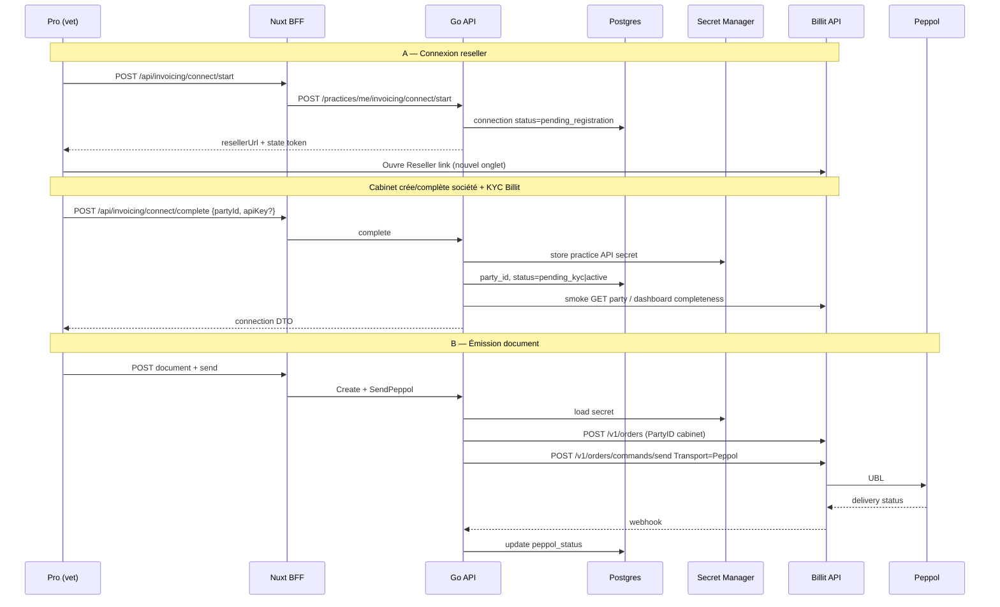

# 34 — Plan technique Billit reseller (petsFollow)

**Statut** : plan technique — **socle T0/T1 + mock livré** (2026-07-27). Client Billit live (T2) et polish UI (T3) restent à faire.  
**Complète** : [33-BILLIT-INTEGRATION.md](33-BILLIT-INTEGRATION.md) (produit / phases / CGV).  
**Ce doc** = mise en place **technique** du mode **Integration Partner / Reseller** : 1 PartyID par cabinet, facturation Billit → LL-IT-SC, UI Pro transparente.

**Livré dans le monorepo** :
- Migration `000082_invoicing_billit`
- `go/internal/invoicing` (domain, service, secrets, mock gateway)
- `store/invoicing.go` + handlers + BFF `/api/invoicing/**`
- Page Pro `/invoicing` (tag `dev`) — connect mock + facture démo
- Tests : `TestComputeTotals` / `TestSealOpen*` / `TestInvoicingConnectAndSendMock` / `TestValidateBillit*`
- `make api-dev` : `BILLIT_ENABLED=true` + `BILLIT_MOCK_ENABLED=true` (opt-in explicite ; **off** par défaut hors Make)
- Garde-fous : `ValidateBillit()` refuse live sans client, refuse `plain_dev` hors `DEV_SEED` ; create document en transaction ; send via claim atomique + plafond docs

Placeholder UI déjà en place : menu Pro `/invoicing` + tag `dev` (`nuxtjs/pages/invoicing.vue`).

---

## 1. Objectif technique

| ID | Objectif |
|----|----------|
| T1 | Provisionner / lier un compte Billit par `practice_id` via **Reseller link** |
| T2 | Stocker `party_id` + accès API de façon sécurisée (jamais au JS) |
| T3 | Appliquer **Invoice to = partner** (ops Billit + tracking côté PF) |
| T4 | Émettre Invoice / CreditNote / ProForma via API Billit sous le PartyID cabinet |
| T5 | Propager les statuts Peppol (webhook / poll) vers Pro |
| T6 | Mock local/CI (`BILLIT_MOCK_ENABLED`) sans appels réseau |

**Hors scope technique v1** : Access Point white-label full (contrat enterprise) ; réception achats Peppol ; Flux A SaaS automatisé (peut rester manuel MyBillit au début — voir §8).

---

## 2. Prérequis Billit (gate avant code prod)

Confirmés par écrit avec Billit sales / support :

| # | Prérequis | Usage code |
|---|-----------|------------|
| R1 | Compte **master** LL-IT-SC (sandbox + prod) | `BILLIT_MASTER_PARTY_ID` + clé master |
| R2 | Lien **Reseller** | `BILLIT_RESELLER_REGISTER_URL` |
| R3 | Accord **Invoice to = partner** | Process : liste PartyID → Billit bascule payeur |
| R4 | Sandbox API + doc headers `PartyID` / `ApiKey` | Client HTTP |
| R5 | Mécanisme webhook (ou polling) statut orders | Handler + table events |
| R6 | Règle clé API multi-companies | Doc Billit : clé user avec accès multi-Party ; toujours header `PartyID` du cabinet |

Réfs Billit :

- [Integration Partner](https://docs.billit.be/docs/when-you-are-an-integration-partner)
- [PartyID and Key](https://docs.billit.be/docs/partyid-and-key)
- [Orders API](https://docs.billit.be/reference/order-1)
- [Developer onboarding](https://docs.billit.be/docs/developer-onboarding-workflow)

---

## 3. Architecture technique



### Packages

```text
go/internal/invoicing/
  domain.go
  service.go                 # orchestration PF
  gateway.go                 # interface
  billit/
    client.go                # HTTP
    auth.go                  # headers PartyID + ApiKey
    orders.go                # create / send / get
    map_order.go
    webhook.go               # verify + parse
  mock/gateway.go

go/internal/handlers/invoicing.go
go/internal/handlers/invoicing_webhook.go
go/internal/store/invoicing.go

nuxtjs/server/api/invoicing/**   # BFF proxy auth cookies
nuxtjs/pages/invoicing/**       # UI (remplace placeholder)
```

Wiring dans `handlers.API` : champ `invoicing *invoicing.Service` (comme `billing`), activé si `BILLIT_ENABLED`.

---

## 4. Modèle de données

### Migration SQL (ex. `0000xx_invoicing_billit.up.sql`)

```sql
CREATE SCHEMA IF NOT EXISTS invoicing;

CREATE TABLE invoicing.practice_connections (
  practice_id            UUID PRIMARY KEY REFERENCES practice.practices(id),
  billit_party_id        TEXT,
  status                 TEXT NOT NULL DEFAULT 'disconnected'
    CHECK (status IN (
      'disconnected',
      'pending_registration',
      'pending_kyc',
      'active',
      'suspended',
      'error'
    )),
  invoice_to_partner     BOOLEAN NOT NULL DEFAULT true,
  partner_listed_at      TIMESTAMPTZ,          -- envoyé à Billit pour Invoice to
  docs_included_monthly  INT NOT NULL DEFAULT 50,
  last_error             TEXT,
  connected_at           TIMESTAMPTZ,
  updated_at             TIMESTAMPTZ NOT NULL DEFAULT now(),
  created_at             TIMESTAMPTZ NOT NULL DEFAULT now()
);

-- Référence opaque vers secret (pas la clé en clair)
-- Ex. "sm:petsfollow-billit-practice-<uuid>" ou "enc:v1:<ciphertext>"
ALTER TABLE invoicing.practice_connections
  ADD COLUMN api_secret_ref TEXT;

CREATE TABLE invoicing.connect_states (
  state           TEXT PRIMARY KEY,
  practice_id     UUID NOT NULL REFERENCES practice.practices(id),
  created_by      UUID NOT NULL REFERENCES identity.users(id),
  expires_at      TIMESTAMPTZ NOT NULL,
  consumed_at     TIMESTAMPTZ
);

CREATE TABLE invoicing.documents (
  id                 UUID PRIMARY KEY,
  practice_id        UUID NOT NULL REFERENCES practice.practices(id),
  type               TEXT NOT NULL CHECK (type IN ('invoice','credit_note','proforma')),
  status             TEXT NOT NULL DEFAULT 'draft',
  number             TEXT,
  billit_order_id    TEXT,
  idempotency_key    TEXT NOT NULL,
  counterparty_json  JSONB NOT NULL DEFAULT '{}',
  currency           TEXT NOT NULL DEFAULT 'EUR',
  total_excl_cents   BIGINT NOT NULL DEFAULT 0,
  total_vat_cents    BIGINT NOT NULL DEFAULT 0,
  total_incl_cents   BIGINT NOT NULL DEFAULT 0,
  related_document_id UUID REFERENCES invoicing.documents(id),
  peppol_status      TEXT,
  sent_at            TIMESTAMPTZ,
  created_by         UUID REFERENCES identity.users(id),
  created_at         TIMESTAMPTZ NOT NULL DEFAULT now(),
  updated_at         TIMESTAMPTZ NOT NULL DEFAULT now(),
  UNIQUE (practice_id, idempotency_key)
);

CREATE INDEX invoicing_documents_practice_created
  ON invoicing.documents (practice_id, created_at DESC);

CREATE TABLE invoicing.document_lines (
  id               UUID PRIMARY KEY,
  document_id      UUID NOT NULL REFERENCES invoicing.documents(id) ON DELETE CASCADE,
  position         INT NOT NULL,
  description      TEXT NOT NULL,
  quantity         NUMERIC(12,3) NOT NULL,
  unit_price_excl_cents BIGINT NOT NULL,
  vat_percent      NUMERIC(5,2) NOT NULL,
  meta_json        JSONB NOT NULL DEFAULT '{}'
);

CREATE TABLE invoicing.webhook_events (
  id            UUID PRIMARY KEY,
  received_at   TIMESTAMPTZ NOT NULL DEFAULT now(),
  provider      TEXT NOT NULL DEFAULT 'billit',
  event_type    TEXT,
  external_id   TEXT,
  payload       JSONB NOT NULL,
  processed_at  TIMESTAMPTZ,
  error         TEXT
);

CREATE TABLE invoicing.usage_monthly (
  practice_id   UUID NOT NULL REFERENCES practice.practices(id),
  yyyymm        INT NOT NULL,           -- 202607
  doc_count     INT NOT NULL DEFAULT 0,
  PRIMARY KEY (practice_id, yyyymm)
);
```

### Statuts document (domaine)

`draft` → `issued` → `sending` → `delivered` | `rejected` → (`cancelled` si Billit le permet)

Pro forma : s’arrête à `issued` (PDF) — **jamais** `SendPeppol`.

---

## 5. Configuration & secrets

### Env API (`go/internal/platform/config`)

| Variable | Défaut | Rôle |
|----------|--------|------|
| `BILLIT_ENABLED` | `false` | Feature flag routes + UI |
| `BILLIT_MOCK_ENABLED` | `true` en `make api-dev` | Gateway mock |
| `BILLIT_BASE_URL` | sandbox URL Billit | HTTP client |
| `BILLIT_MASTER_PARTY_ID` | — | Flux A / ops |
| `BILLIT_MASTER_API_KEY` | SM | Master |
| `BILLIT_RESELLER_REGISTER_URL` | — | Lien partner |
| `BILLIT_WEBHOOK_SECRET` | SM | Vérif webhook |
| `BILLIT_DEFAULT_DOCS_INCLUDED` | `50` | Plafond |
| `BILLIT_SECRETS_BACKEND` | `local_enc` \| `gcp_sm` | Où vivent les clés practice |
| `BILLIT_SECRETS_KEY` | — | Clé AES locale (dev) |

### Secret Manager (staging/prod)

| Secret | Env / usage |
|--------|-------------|
| `petsfollow-billit-master-api-key` | Master |
| `petsfollow-billit-webhook-secret` | Webhook |
| `petsfollow-billit-practice-<practice_id>` | Clé API practice (si backend SM) |

### Règle sécurité (alignée projet)

- Cookies auth inchangés (httpOnly BFF).  
- Clés Billit **jamais** dans `localStorage` / réponses JSON client (sauf éventuellement masquage `••••` côté admin).  
- Webhook : comparaison secret **temps constant** (`secretHeaderOK` ou HMAC selon contrat Billit).  
- Complete connect : rate-limit par `practice_id` / user.

---

## 6. Contrats API petsFollow

Envelope `{ data: ... }` comme le reste de l’API.

### Connexion reseller

| Méthode | Path | Body / notes |
|---------|------|----------------|
| `GET` | `/api/v1/practices/me/invoicing/connection` | Statut, partyId masqué partiel, docsIncluded, usage mois |
| `POST` | `/api/v1/practices/me/invoicing/connect/start` | Vérifie profil société (TVA/BCE/adresse) ; crée `connect_states` ; retourne `{ resellerUrl, state, expiresAt }` |
| `POST` | `/api/v1/practices/me/invoicing/connect/complete` | `{ state, partyId, apiKey }` — `apiKey` uniquement si Billit ne fournit pas OAuth partner ; chiffrement immédiat ; smoke test |
| `POST` | `/api/v1/practices/me/invoicing/connect/refresh` | Re-check KYC / completeness Billit |
| `DELETE` | `/api/v1/practices/me/invoicing/connect` | Soft : `suspended` + révocation secret PF (pas forcément delete Billit) |

`resellerUrl` = `BILLIT_RESELLER_REGISTER_URL` (+ query `state` / `ref=practiceId` si Billit le permet ; sinon state only côté PF au retour).

### Documents

| Méthode | Path |
|---------|------|
| `GET` | `/api/v1/practices/me/invoicing/documents?cursor=&type=` |
| `POST` | `/api/v1/practices/me/invoicing/documents` |
| `GET` | `/api/v1/practices/me/invoicing/documents/{id}` |
| `PATCH` | `/api/v1/practices/me/invoicing/documents/{id}` (draft only) |
| `POST` | `/api/v1/practices/me/invoicing/documents/{id}/send` |
| `POST` | `/api/v1/practices/me/invoicing/documents/{id}/credit-note` |

### Webhook & admin

| Méthode | Path | Auth |
|---------|------|------|
| `POST` | `/api/v1/billing/webhooks/billit` (ou `/invoicing/webhooks/billit`) | Signature Billit |
| `GET` | `/api/v1/admin/invoicing/connections` | admin |
| `POST` | `/api/v1/admin/invoicing/connections/{practiceId}/mark-partner-invoiced` | admin — après envoi liste à Billit |
| `GET` | `/api/v1/admin/invoicing/usage?yyyymm=` | admin |

### BFF Nuxt

Miroir sous `nuxtjs/server/api/invoicing/**` via `server/utils/api.ts` (cookies httpOnly).  
Page publique webhook : **pas** via BFF si signature raw body — route Go directe (comme Stripe).

---

## 7. Client Billit (driver)

### Headers (par appel practice)

```http
PartyID: <billit_party_id>
Authorization: <api_key>   # selon doc Billit (header exact à caler sandbox)
Content-Type: application/json
```

### Mapping domaine → Order

| Domaine PF | Billit |
|------------|--------|
| `invoice` | `OrderType: Invoice`, `OrderDirection: Income` |
| `credit_note` | Credit note type (doc Billit) |
| `proforma` | Offer / quote — **sans** send Peppol |
| Lignes | `OrderLines[]` qty, UnitPriceExcl, VATPercentage, Description |
| Client | `Customer` Name, VATNumber, Addresses |

Après create : stocker `billit_order_id` ; send :

```json
{ "Transporttype": "Peppol", "OrderIDs": [ <id> ] }
```

### Idempotency

- Clé PF : `practice_id + type + business_key` (ex. UUID document).  
- Avant POST Billit : si `billit_order_id` déjà présent → skip create, éventuellement re-send contrôlé.  
- Webhook : dédup sur `(provider, external_id, event_type)` ou hash payload.

### Mock

`mock.Gateway` :

- `EnsureParty` → `party_mock_<practiceShort>`  
- `CreateDocument` → incrément ID  
- `SendPeppol` → statut `delivered` async via goroutine ou immédiat  
- Utilisé si `BILLIT_MOCK_ENABLED=true` (CI / `make api-dev`)

---

## 8. Flux reseller — détails d’implémentation

### 8.1 Préconditions cabinet (`connect/start`)

Reprendre champs déjà présents sur `practice.practices` :

- `company_legal_name`, `vat_number`, `company_number` (BCE)  
- adresse + `contact_email`  
- Si profil incomplet → `409` / `422` avec code `practice_profile_incomplete` (même esprit que payout commissions)

### 8.2 Parcours UX (Pro)

1. `/invoicing` : si `disconnected` → CTA « Activer »  
2. Modal consentement CGU e-invoicing  
3. `connect/start` → bouton « Ouvrir l’inscription Billit » (`target=_blank` + `resellerUrl`)  
4. Écran retour : saisie **PartyID** (+ API key si requis) → `connect/complete`  
5. Badge statut `pending_kyc` jusqu’à refresh OK → `active`  
6. Liste documents débloquée seulement si `active`

> **Note** : tant que Billit n’offre pas de callback OAuth partner, l’étape 4 est manuelle (copier PartyID depuis MyBillit). Prévoir évolution `connect/oauth/callback` si Billit l’ajoute.

### 8.3 Invoice to partner (ops + tech)

1. Admin liste les `billit_party_id` avec `invoice_to_partner=true` et `partner_listed_at IS NULL`  
2. Export CSV / envoi support Billit (process Phase 0)  
3. Admin `mark-partner-invoiced` → set `partner_listed_at`  
4. Alerte ops si connection `active` depuis >7 j sans `partner_listed_at`

Pas d’API Billit publique garantie pour basculer *Invoice to* → **outil admin + runbook**, pas automatisme fragile.

### 8.4 Flux A (SaaS LL-IT-SC → cabinet)

Hors chemin critique reseller v1 :

- Émission manuelle MyBillit master **ou**  
- Job interne ultérieur utilisant `BILLIT_MASTER_*` + customers = practices

Ne pas bloquer T1–T5 dessus.

---

## 9. UI Nuxt (remplacement placeholder)

| Route | Contenu |
|-------|---------|
| `/invoicing` | Liste + empty + CTA connect ; garder badge `dev` jusqu’à GA |
| `/invoicing/connect` | Wizard étapes 8.2 |
| `/invoicing/documents/new` | Formulaire lignes |
| `/invoicing/documents/[id]` | Détail + send + NC |

Composants `Pro*` uniquement.  
i18n : étendre `invoicing.*` (6 locales).  
Tag menu `dev` : retirer quand `BILLIT_ENABLED` prod + pilote OK (feature flag Nuxt `NUXT_PUBLIC_INVOICING_DEV_TAG=true` optionnel).

---

## 10. Tests (anti-régression)

| Niveau | Contenu |
|--------|---------|
| Unit | `map_order`, totaux TVA, idempotency key |
| Integration Go | `newTestAPI` + mock : connect complete → create → send → webhook status |
| Webhook | signature invalide → 401 ; replay idempotent |
| Playwright | `@p1` : nav tag dev, wizard mock, créer draft (staging mock) |
| Plan tests | Section dans [15](15-PLAN-TESTS.md) |
| Use case | UC commercial facturation + `make usecases-sync` à l’activation démo |

CI : **toujours** mock — jamais Billit live.

---

## 11. Découpage sprints techniques

### Sprint T0 — Foundations (3–4 j)

- [ ] Config + feature flags  
- [ ] Migration SQL  
- [ ] `store/invoicing.go` CRUD connections + documents  
- [ ] Interface `InvoicesGateway` + `mock`  
- [ ] Routes handlers stub + BFF stub  
- [ ] Tests store + mock service

### Sprint T1 — Reseller connect (4–5 j)

- [ ] `connect/start` + `connect_states`  
- [ ] `connect/complete` + secret backend (`local_enc` d’abord)  
- [ ] `connect/refresh` (mock completeness)  
- [ ] UI wizard `/invoicing/connect`  
- [ ] Admin list connections  
- [ ] Tests integration connect

### Sprint T2 — Orders Billit live sandbox (5–7 j)

- [ ] Client HTTP réel (sandbox)  
- [ ] Create invoice + lines mapping  
- [ ] Send Peppol + proforma sans send  
- [ ] Credit note  
- [ ] Webhook handler + maj statuts  
- [ ] Usage monthly increment on successful send  
- [ ] Tests + smoke manuel sandbox 1 PartyID

### Sprint T3 — UI documents + polish (4–5 j)

- [ ] Liste / détail / new  
- [ ] Plafond docs + banner  
- [ ] i18n 6 locales  
- [ ] Playwright  
- [ ] Runbook ops Invoice to partner  
- [ ] Retirer ou garder tag `dev` selon flag

### Sprint T4 — Staging / pilote (ops + 2 j)

- [ ] Secrets SM GCP  
- [ ] `BILLIT_ENABLED=true` staging  
- [ ] 2 cabinets pilotes  
- [ ] Vérifier absence de facture Billit chez le cabinet  
- [ ] Gate prod

**Effort total** : ~4–5 semaines dev après R1–R3, hors délai commercial Billit.

---

## 12. Runbook ops (extraits)

### Ajouter un cabinet au Invoice to partner

1. Vérifier `status=active` et `billit_party_id` renseigné  
2. Exporter CSV admin  
3. Envoyer à Billit (template mail Phase 0)  
4. `mark-partner-invoiced`  
5. Contrôler facture Billit mensuelle consolidée

### Rotation clé API practice

1. Générer nouvelle clé dans MyBillit  
2. Admin ou `connect/complete` update secret  
3. Smoke `refresh`  
4. Invalider ancienne clé côté Billit

### Incident Peppol rejected

1. Lire `peppol_status` + payload webhook  
2. Corriger TVA / BCE contrepartie  
3. Crédit + re-facture ou correction selon règles fiscales

---

## 13. Critères Done (reseller)

- [ ] `connect/start` → URL reseller configurée  
- [ ] `connect/complete` stocke PartyID + secret hors clairtext DB  
- [ ] Document invoice créé et envoyé Peppol en sandbox sous PartyID cabinet  
- [ ] Webhook met à jour le statut en base  
- [ ] Mock CI vert  
- [ ] Admin peut lister connexions et marquer partner-invoiced  
- [ ] Aucune clé Billit dans les réponses `/api/*` consommées par le browser  
- [ ] Tag `dev` visible tant que non GA

---

## 14. Liens

| Doc | Rôle |
|-----|------|
| [33](33-BILLIT-INTEGRATION.md) | Produit, prix 88 €, phases 0–5, risques |
| [27](27-PHARMACIE-BELGIQUE.md) | Futur `invoices.connect` → même gateway |
| [07](07-STRIPE-BILLING.md) | Stripe B2C (ne pas mélanger) |
| Placeholder | `nuxtjs/pages/invoicing.vue` + `nav.tagDev` |

| Champ | Valeur |
|-------|--------|
| Créé | 2026-07-27 |
| Prochaine revue | Après obtention Reseller link + sandbox keys (R2–R4) |
