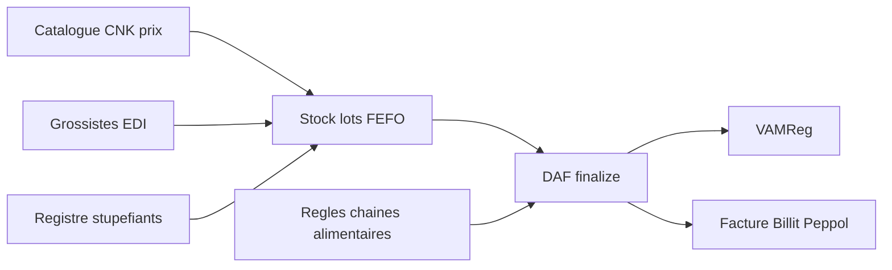
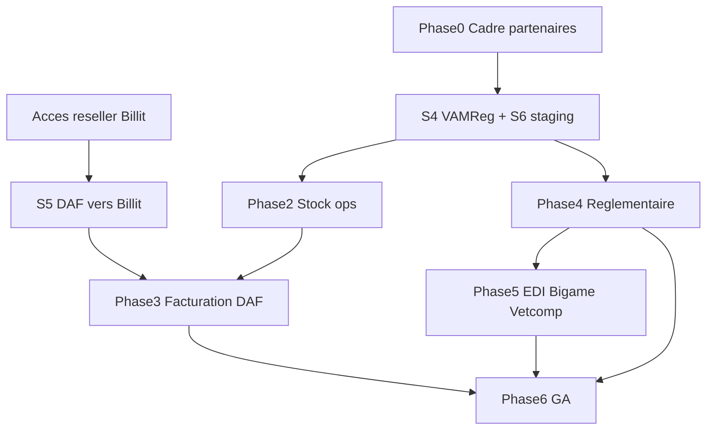

# 37 — Roadmap stock opérationnel + réglementaire + facturation

**Objectif** : rendre opérationnelle et conforme la boucle cabinet (stock → DAF → VAMReg → facture), face au deal-breaker « pharmacie + facturation ».

| Méta | Valeur |
|------|--------|
| Statut | **Cadré** · S4 ✅ · Phase 2.A–2.E ✅ · 2.F **staging** catalogue ✅ (prod à faire) · 4.C/4.D/4.F ✅ · S6 ✅ · S5 / Phase 3 gelés (P0-2) |
| Socle Phase 1 | [27-PHARMACIE-BELGIQUE.md](27-PHARMACIE-BELGIQUE.md) · [28-PLAN-STOCK-PEREMPTION.md](28-PLAN-STOCK-PEREMPTION.md) |
| Facturation | [33-BILLIT-INTEGRATION.md](33-BILLIT-INTEGRATION.md) · [34-BILLIT-RESELLER-TECH.md](34-BILLIT-RESELLER-TECH.md) |
| Dernière revue | 2026-08-11 (audit A–D + UI stock mouvements/prix/seuils/settings) |

**Hors scope** (retour véto clinique / offline) : normes vitals, templates dentaires UGent, canvas protocoles, mode offline Flutter — backlog séparé.

---

## 0. Phase 0 — Cadrage partenaires & données (suivi)

Sans ces prérequis, les phases techniques restent un « presque conforme ».

| ID | Livrable | Owner | Statut | Critère de sortie |
|----|----------|-------|--------|-------------------|
| P0-1 | Accès / contrat API **VAMReg** (dry-run + calendrier go-live) | Ops / juridique | 🟡 Client **readonly** listes OK ([39](39-VAMREG-AFMPS-READONLY.md)) · write déclaration + credentials live encore ouverts | Credentials SM + env test + ICD write |
| P0-2 | **Accès reseller Billit** | Ops | 🟡 **En attente — aucun chantier S5/Phase 3 tant que credentials absents** | Credentials reseller → débloque S5 + Phase 3 |
| P0-3 | Source officielle catalogue **AFMPS / CNK** (licence, cadence maj) | Produit / Ops | 🟢 Licence + cadence + pipeline cron ✅ · **staging** : CSV GCS + commit catalogue (~2738 CNK, 2026-08-11) · **prod** : même runbook à répéter | Critère staging atteint ; prod opt-in |
| P0-4 | Inventaire obligations **stupéfiants BE** + modèle registre | Produit / juridique | ⬜ Ouvert | Spec figée avant Phase 4.B |
| P0-5 | Contact / docs API **grossistes** (1 pilote : Covetrus / Alcyon / Crocodil) | Produit | ⬜ Ouvert | Scope Phase 5.A |
| P0-6 | **Bigame / Vetcompendium** — build vs licence | Produit | ⬜ Ouvert | Décision build/buy écrite |
| P0-7 | Trajectoire **certification DAF** vs disclaimer actuel | Juridique | ⬜ Ouvert | Écrit produit + juridique |

### Suivi P0 partenaires (hors code) — 2026-08-11

Actions ops / juridique à pousser **en parallèle** du code (pas de chantier technique tant que le critère de sortie n’est pas atteint) :

| ID | Prochaine action concrète | Bloque |
|----|---------------------------|--------|
| **P0-1** | Relancer AFMPS/VAMReg pour credentials **write** (ICD) + env test SM ; readonly déjà OK ([39](39-VAMREG-AFMPS-READONLY.md)) — suivi 2026-08-11 | 4.A production |
| **P0-2** | Relancer Billit **accès reseller** (mail/compte) ; aucun code DAF→facture live tant qu’absent — suivi 2026-08-11 | 3.C–3.E, GA facture |
| **P0-3** | ✅ Staging fait (CSV `afmps-imports/latest.csv` + job completed ~2738 CNK, scheduler mensuel) · reste **prod** (`petsfollow-media-prod` + secret/scheduler prod) | 2.F prod |
| **P0-4** | Spec registre **stupéfiants BE** figée (champs, durée conservation, export) | 4.B |
| **P0-5** | Contacter 1 grossiste pilote (docs API EDI) | 5.A |
| **P0-6** | Décision écrite **build vs licence** Bigame/Vetcompendium notices | 5.B/C |
| **P0-7** | Note juridique certif DAF vs disclaimer UI actuel | 4.E |

**Note** : l’admin Compendium PDF (`/admin/compendium-imports`, D11b) est **livré** sous flag `dev` — distinct de P0-6 / Phase 5.C (notices commerciales Vetcompendium).

### Prérequis facturation — Billit reseller (figé)

**On attend encore les accès reseller Billit.** Tant qu’ils ne sont pas reçus :

- **Gelé** : Phase 3, Peppol live cabinet, GA facturation.
- **Livré sans reseller** : BIL-9 — lignes de facture préremplies (acte du type de RDV + DAF finalisé de la visite) via `GET /practices/me/invoicing/prefill`, en mock comme en live.
- **Poursuivable** : S4 VAMReg, S6 staging pharmacie, Phase 2 stock ops, Phase 4 réglementaire (hors lien facture), Phase 5 grossistes/Bigame.
- Socle Billit déjà dans le repo : **ne pas ré-implémenter** ; ne pas pousser DAF→facture en pilote réel sans reseller.

---

## 1. Architecture cible

---

## 2. Phase 1 — Fermer le socle (S4–S6)

Voir détail d’exécution dans [28-PLAN-STOCK-PEREMPTION.md](28-PLAN-STOCK-PEREMPTION.md).

| Sprint | Contenu | Statut |
|--------|---------|--------|
| **S4** VAMReg | `job_audit`, Asynq opt-in, dry-run sync, retry UI | ✅ Dry-run |
| **S5** DAF→Billit | BIL-9 lignes préremplies (acte + DAF) | ✅ Livré · worker `invoices.connect` toujours ⏸ (P0-2) |
| **S6** Ops staging | `PHARMACY_ENABLED`, `VAMREG_DRY_RUN`, workers env, `pg_trgm`, smoke, UC | ✅ Env/secrets · `pg_trgm` · smoke MVP · `smoke-pharmacy-s6-staging` · UC-VP-05 |

**Done when (chemin stock)** : pilote staging — receipt → DAF → VAMReg dry-run OK.  
**Done when (chemin facture)** : + draft Billit lié DAF — **après** P0-2.

---

## 3. Phase 2 — Stock cabinet opérationnel

Objectif : tourner sans Excel (hors EDI).

| ID | Chantier | Contenu | Done when |
|----|----------|---------|-----------|
| 2.A | Catalogue prix practice | Prix achat / vente HT + TVA par CNK | ✅ API + **UI** `/stock` (carte prix) |
| 2.B | Seuils & alertes réassort | Seuil min + `GET …/reorder-alerts` | ✅ API + **UI** édition seuil + alertes |
| 2.C | Commandes internes | Brouillon + e-mail fournisseur (CSV) | ✅ API `orders` + UI `/stock` + `SendVetAlertWithCSV` |
| 2.D | Réception enrichie | BL manuel (n°, fournisseur, lignes → lots) + notif | ✅ API `delivery-notes` + UI BL optionnel |
| 2.E | Inventaire annuel | Session, écarts → adjust, export | ✅ API `inventory/sessions` + UI `/stock` + CSV |
| 2.F | Import CNK national | Pipeline AFMPS admin/CLI ✅ · job interne mensuel gate 1 (`/internal/afmps-import/run`) ✅ · catalogue national en base | 🟢 **Staging** catalogue commité (2026-08-11) · prod = même dépôt/commit |
| — | UI journal / settings | Mouvements, waste reasons, settings expiry, adjust manuel | ✅ composants `pharmacy/Stock*` |

**Dépendances** : P0-3 pour 2.F ; 2.A utile à Phase 3.

---

## 4. Phase 3 — Facturation associée (après reseller)

**Prérequis** : P0-2 (accès reseller Billit branchés SM + staging).

**Gate code** : `pharmacy.EnqueueInvoicesConnect` → `ErrInvoicesConnectResellerPending` jusqu’au déblocage (ne pas brancher sur finalize).

| ID | Chantier | Contenu | Statut |
|----|----------|---------|--------|
| 3.A | Mapping DAF → lignes | Lignes proposées par l’API (qty, libellé, prix catalogue, TVA) ; revue humaine avant envoi | ✅ Livré (`/invoicing/prefill`) |
| 3.B | Parcours consultation | CTA post-CR : acte tarifé + lignes DAF préremplies | ✅ Livré |
| 3.C | Avoirs / retours | Credit note + cohérence stock | ⏸ |
| 3.D | KYC & quotas | Connexion `active`, plafonds, runbook rejet | ⏸ |
| 3.E | Reporting | CA médicaments, marge, export comptable | ⏸ |

Lien ticket : **BIL-9** — [33 § Phase 5](33-BILLIT-INTEGRATION.md) — **livré** ; le reste de la Phase 3 (avoirs/stock, KYC, reporting) attend les accès reseller.

---

## 5. Phase 4 — Conformité réglementaire cœur (BE / UE)

| ID | Chantier | Contenu | Écart actuel |
|----|----------|---------|--------------|
| 4.A | VAMReg production | Dry-run → API réelle ; audit ; alertes | Gate + worker dry-run · attend P0-1 |
| 4.B | Registre stupéfiants | Flag substances ; mouvements ; export ; UI | Absent — attend P0-4 |
| 4.C | Temps d’attente structurés | Viande / lait / œufs sur référentiel + DAF | ✅ Colonnes ref + snapshot DAF + PDF + `PATCH …/withdrawal` |
| 4.D | Chaîne alimentaire | Statut animal ; DAF obligatoire ; éviction (ex. phénylbutazone) | ✅ `food_chain_status` + gate finalize + ban flag |
| 4.E | Mentions DAF renforcées | Alignement AFMPS + revue juridique PDF | Disclaimer non certifié — attend P0-7 |
| 4.F | Traçabilité 5 ans | Rétention / export registres ; pas de purge destructive mouvements | ✅ Job rétention users **n’efface pas** `pharmacy.*` · `REVOKE UPDATE/DELETE` mouvements (000172) · `GET …/movements/retention-stats` · inventaire CSV · runbook 38 |

---

## 6. Phase 5 — Intégrations externes

| ID | Chantier | Contenu | Prérequis |
|----|----------|---------|-----------|
| 5.A | Grossistes EDI | Catalogue, n° dépôt, tarifs, commande B2B, BL électronique | P0-5 |
| 5.B | Bigame | Animaux de production | P0-6 |
| 5.C | Vetcompendium | Notices / posologies / temps d’attente | P0-6 |

---

## 7. Phase 6 — GA pharmacie (+ facturation si P0-2)

| Critère | Statut / action |
|---------|-----------------|
| Flags staging + prod documentés | 🟡 Staging pharmacy + VAMReg dry-run/workers dans [10](10-GCP-DEPLOIEMENT.md) ; prod opt-in |
| Retrait `nav.tagDev` | ⬜ Décision produit explicite |
| UC commerciaux + `make usecases-sync` | ✅ [UC-VP-05](../useCase/01-vetpro/UC-VP-05-pharmacie-stock-daf.md) |
| Matrice P0 [15-PLAN-TESTS.md](15-PLAN-TESTS.md) | ✅ C7.1–C7.15 |
| Runbook cabinet | ✅ [38-RUNBOOK-PHARMACIE-CABINET.md](38-RUNBOOK-PHARMACIE-CABINET.md) |
| Fiche produit / concurrence | ⬜ Claim aligné sur livré réel |

Sans reseller : GA possible **pharmacie seule** (tag `dev` facturation conservé).

---

## 8. Ordre & dépendances

**Priorité actuelle** : attendre P0 pour 2.F / 4.A–B–E / Phase 5 · **P0-2 Billit reseller** → S5 → Phase 3 (aucun code facture DAF tant que credentials absents). S6 staging clôturé (PR #3 + re-seed job + smoke).  
**Facturation** : dès P0-2 → S5 → Phase 3.

---

## 9. Ordre de grandeur (indicatif, 1–2 devs)

| Phase | Effort | Nature |
|-------|--------|--------|
| 0 | 2–4 sem | Juridique / partenaires |
| 1 | 3–5 sem | S4–S6 (S5 gelé) |
| 2 | 4–6 sem | Stock ops + prix + inventaire |
| 3 | 3–5 sem | DAF↔Billit (après reseller) |
| 4 | 6–10 sem | Stupéfiants + chaîne alimentaire + VAMReg live |
| 5 | 8–16 sem | EDI + Bigame + Vetcompendium |
| 6 | 1–2 sem | GA / docs / UC / flags |

---

## 10. Liens

| Doc | Rôle |
|-----|------|
| [27](27-PHARMACIE-BELGIQUE.md) | Spec technique Phase 1 |
| [28](28-PLAN-STOCK-PEREMPTION.md) | Suivi sprints S0–S6 |
| [33](33-BILLIT-INTEGRATION.md) | Billit + BIL-9 |
| [15](15-PLAN-TESTS.md) | P0 / QA |
| [04-MODULES-METIER.md](04-MODULES-METIER.md) | Modules |
