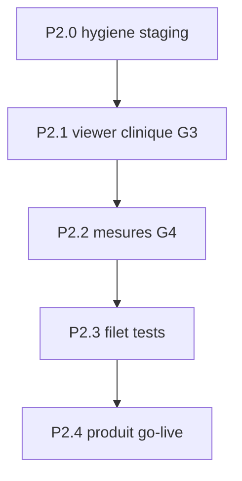

# 40-PACS — Plan P2 (vers GA clinique)

> **Statut** : arbitrage viewer **A (Cornerstone3D)** acté — **prêt à démarrer P2.0**.  
> Prérequis : P0 (tenant lock + launch) + P1 (multi-série/frame, download, admin wake) livrés sur `staging` (`0e3512d` + `7e148d4`).  
> Doc module : [`40-PACS.md`](40-PACS.md) · règle tag `dev` : [`.cursor/rules/modules-tag-dev.mdc`](../.cursor/rules/modules-tag-dev.mdc).

## Objectif

Passer le module Imagerie d’un **outil démo tag `dev`** (previews PNG Orthanc + canvas) à un **viewer clinique crédible** prêt pour une **décision GA** explicite — sans C-STORE, sans partage client, sans archivage multi-pays.

## Déjà livré (hors P2)

| Lot | Contenu |
|-----|---------|
| P0 | `UNIQUE(orthanc_study_id)`, ParentSeries authz, launch pad, isolation tests, deploy staging |
| P1 | Multi-série, multi-frame, download `.dcm`, admin wake, purge Orthanc testée |
| Review | Frame EOF = 404 only, reset `waking`, magic DICM download |

Checklist GA G5 / G6 / G7 : **faits** (rester documentés dans `40-PACS.md`).

## Hors scope P2 (inchangé)

- C-STORE / DIMSE modalités
- Partage d’images vers le client Flutter
- PgBouncer dédié Orthanc
- Conformité archivage légal multi-pays
- Use case commercial **avant** décision G1 / retrait `nav.tagDev`

---

## Arbitrage viewer (tranché)

| Option | Approche | Décision |
|--------|----------|----------|
| **A — Cornerstone3D** | Lazy client-only + WASM ; pixels via WADO-RS Orthanc (proxy Go) ou decode `.dcm` | **Retenu** (2026-07-31) |
| B — Canvas + metadata | PNG Orthanc + `PixelSpacing` | Rejeté (plafond clinique) |

**Conséquences** : P2.1 = spike CSP + Cornerstone3D ; G3/G4 sur moteur Cornerstone ; fallback canvas conservé derrière flag `pacsViewerEngine` le temps de la migration.

Tant que G1 n’est pas signé, **ne pas** retirer `nav.tagDev` et **ne pas** inventer de UC commercial.

---

## Phases

### P2.0 — Hygiene & alignement staging

- [x] Déployer `7e148d4` (EOF / waking / DICM) — Cloud Build `f3668332…` SUCCESS (2026-07-31).
- [x] Smoke MVP staging OK ; PACS wake → ready → preview PNG 200 → file DICM 200.
- [ ] Hotfix : Orthanc preview **400|404** → client 404 (`orthancStatusError`) — à déployer + re-smoke frame hors plage.
- Mettre à jour l’état G5/G6 dans `40-PACS.md` (déjà livré P1).

**Done P2.0** : quand OOR → 404 en staging.

### P2.1 — Viewer clinique (G3) — Cornerstone3D

1. Spike CSP : `buildCsp()` — `wasm-unsafe-eval` / workers **explicitement**, pas `*`.
2. Package `@cornerstonejs/*` lazy, `ClientOnly`, flag UI interne `pacsViewerEngine=cornerstone|canvas` (canvas = fallback).
3. Pipeline pixels : **proxy Go** (WADO-RS Orthanc ou stream `…/file`) — le navigateur **ne parle jamais** à Orthanc.
4. Nouveau viewer Cornerstone (pan/zoom/W/L HU/stack) ; coexister avec `DicomViewer.vue` canvas jusqu’à bascule.
5. Conserver authz `TestPacs*` inchangée (gate `practice_id`).

**Done** : W/L HU démontrable sur fixture CT/RX via Cornerstone ; pas de régression authz ; e2e smoke viewer.

### P2.2 — Mesures calibrées (G4)

- Lire `PixelSpacing` (ou `ImagerPixelSpacing`) via Orthanc tags / metadata.
- Mesure longueur en **mm** (fallback px si spacing absent + hint UI).
- i18n unités ; test unitaire helper calibration ; e2e mesure non-régression.

**Done** : mesure affiche mm sur fixture avec spacing ; px documenté si absent.

### P2.3 — Filet anti-régression GA

| Surface | Ajout |
|---------|--------|
| Go | Metadata / WADO proxy si nouveau ; garder isolation tenant |
| Vitest | Helper spacing + (si A) smoke mount CSP-safe |
| Playwright `@p0` | Download, frame next (404 EOF), admin wake ; si A : ouverture Cornerstone |
| Doc | `15-PLAN-TESTS.md` section PACS |

**Done** : `make test-go` (`TestPacs*`) + `make test-e2e-p0` verts avec flag on.

### P2.4 — Produit & go-live (G1, G2, G8)

1. **G1** — Note produit écrite (GA vs rester `dev`) dans ce fichier ou ADR court.
2. **G2** — Doc opt-in prod `PACS_ENABLED` / `NUXT_PUBLIC_PACS_ENABLED` (défaut **off** prod) + runbook smoke.
3. Si GA décidé :
   - Retirer `nav.tagDev` / badges Imagerie + admin (règle modules-tag-dev).
   - **G8** — UC commercial `useCase/` + `make usecases-sync` + session démo README.
4. Sinon : rester `dev`, pas de UC inventé.

**Done** : décision tracée ; si GA → badge retiré + UC sync + flags prod documentés.

---

## Critères GA restants (après P2)

| # | Critère | Entrée P2 |
|---|---------|-----------|
| G1 | Décision produit | P2.4 |
| G2 | Flag prod opt-in | P2.4 |
| G3 | W/L clinique / Cornerstone | P2.1 |
| G4 | Mesures calibrées | P2.2 |
| G5–G7 | Multi-série/frame, download, erreurs | **Déjà OK** |
| G8 | Use case commercial | P2.4 (si GA) |
| G9 | Index doc | Maintenir `40` + ce plan |
| G10 | Hors V1 | Toujours hors |

---

## Ordre d’exécution proposé

1. ~~Valider Option A vs B~~ → **A acté**.
2. Exécuter **P2.0** (deploy `7e148d4` + smoke).
3. **P2.1 → P2.2 → P2.3** sur branche `feat/pacs-ga` (ou équivalent) depuis `staging`.
4. Review + staging deploy + smoke.
5. **P2.4** uniquement après OK produit.

## Estimation indicative

| Phase | Ordre de grandeur |
|-------|-------------------|
| P2.0 | 0,5 j |
| P2.1 Cornerstone | 3–6 j |
| P2.2 | 1–2 j |
| P2.3 | 1–2 j |
| P2.4 | 0,5–1 j |

---

## Validation

- [x] Arbitrage **A (Cornerstone3D)** acté (2026-07-31)
- [ ] Démarrer P2.0 (deploy review + smoke)
- [ ] P2.1+ uniquement après P2.0 vert
