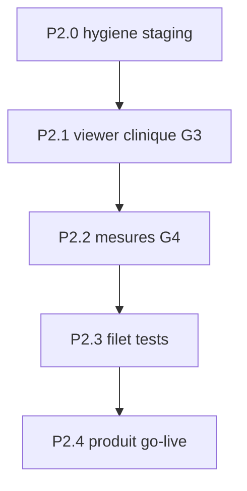

# 40-PACS — Plan P2 (vers GA clinique)

> **Statut** : **P2.0–P2.4 clos** (2026-07-31). G1 = **rester tag `dev`** (pas de GA / pas de UC commercial).  
> Prérequis : P0 + P1 livrés · arbitrage **A Cornerstone3D** acté.  
> Doc module : [`40-PACS.md`](40-PACS.md) · règle tag `dev` : [`.cursor/rules/modules-tag-dev.mdc`](../.cursor/rules/modules-tag-dev.mdc).

## Objectif

Passer le module Imagerie d’un **outil démo tag `dev`** (previews PNG Orthanc + canvas) à un **viewer clinique crédible** prêt pour une **décision GA** explicite — sans C-STORE, sans partage client, sans archivage multi-pays.

## Déjà livré (hors P2)

| Lot | Contenu |
|-----|---------|
| P0 | `UNIQUE(orthanc_study_id)`, ParentSeries authz, launch pad, isolation tests, deploy staging |
| P1 | Multi-série, multi-frame, download `.dcm`, admin wake, purge Orthanc testée |
| Review | Frame EOF = 404 only, reset `waking`, magic DICM download |

Checklist GA G5 / G6 / G7 : **faits** (rester documentés dans `40-PACS.md`).

## Hors scope P2 (inchangé)

- C-STORE / DIMSE modalités
- Partage d’images vers le client Flutter
- PgBouncer dédié Orthanc
- Conformité archivage légal multi-pays
- Use case commercial **avant** décision G1 / retrait `nav.tagDev`

---

## Arbitrage viewer (tranché)

| Option | Approche | Décision |
|--------|----------|----------|
| **A — Cornerstone3D** | Lazy client-only + WASM ; pixels via WADO-RS Orthanc (proxy Go) ou decode `.dcm` | **Retenu** (2026-07-31) |
| B — Canvas + metadata | PNG Orthanc + `PixelSpacing` | Rejeté (plafond clinique) |

**Conséquences** : P2.1 = spike CSP + Cornerstone3D ; G3/G4 sur moteur Cornerstone ; fallback canvas conservé derrière flag `pacsViewerEngine` le temps de la migration.

Tant que G1 ≠ GA, **ne pas** retirer `nav.tagDev` et **ne pas** inventer de UC commercial.

---

## Phases

### P2.0 — Hygiene & alignement staging *(clos)*

- [x] Déployer `7e148d4` puis hotfix `b32145b` (EOF 400|404 → 404 client).
- [x] Smoke MVP ; PACS wake → ready → preview/file.
- [x] Filet frame hors plage → **404** (Go `TestPacs*` + e2e `20c`) ; re-smoke live post-deploy du lot P2.1–P2.3.
- Docs P2 + checklist G5/G6 : faits.

### P2.1 — Viewer clinique (G3) — Cornerstone3D *(clos)*

1. [x] Spike CSP : `wasm-unsafe-eval` + `worker-src 'self' blob:` (pas `*`).
2. [x] Packages `@cornerstonejs/*` + Vite exclude loader ; flag `NUXT_PUBLIC_PACS_VIEWER_ENGINE` (défaut **canvas**).
3. [x] Metadata proxy Go `GET …/instances/{id}/metadata` (PixelSpacing, W/L tags) — BFF Nuxt.
4. [x] `CornerstoneDicomViewer.vue` opt-in (wadouri → BFF `/file`) ; canvas reste défaut.
5. [x] Tools Cornerstone (pan/zoom/W/L HU/Length) + e2e smoke engine=cornerstone (branche dans `20b-pacs-imaging`).
6. Authz `TestPacs*` inchangée.

**Done P2.1** : W/L HU démontrable via Cornerstone avec flag on ; e2e non soft-skip.

### P2.2 — Mesures calibrées (G4) *(clos)*

- [x] Lire `PixelSpacing` (ou `ImagerPixelSpacing`) via Orthanc tags / metadata API.
- [x] Mesure longueur en **mm** (canvas + helper ; gate Rows×Columns vs bitmap preview ; fallback px + hint).
- [x] i18n unités / badge calibrage ; Vitest `pacs-measure.spec.ts`.
- [x] Cornerstone Length : `calibrateImageSpacing` depuis metadata API (try/catch ; badge = spacing appliqué).

**Done** : mesure affiche mm sur fixture avec spacing ; px documenté si absent.

### P2.3 — Filet anti-régression GA *(clos)*

| Surface | Ajout |
|---------|--------|
| Go | `TestPacs*` (OOR 404, isolation, upload…) — inchangé |
| Vitest | `pacs-measure` + CSP wasm (`buildCsp`) |
| Playwright `@p0` | [`20c-pacs-ga-net`](../nuxtjs/tests/e2e/specs/20c-pacs-ga-net.spec.ts) download `.dcm` + frame OOR 404 ; [`20-pacs-admin`](../nuxtjs/tests/e2e/specs/20-pacs-admin.spec.ts) wake clic ; [`20b`](../nuxtjs/tests/e2e/specs/20b-pacs-imaging.spec.ts) upload/viewer |
| Doc | `15-PLAN-TESTS.md` section PACS |

**Done** : `make test-go` (`TestPacs*`) + `make test-e2e-p0` (flag on) couvrent download / EOF / admin wake.

### P2.4 — Produit & go-live (G1, G2, G8) *(clos — rester `dev`)*

#### G1 — Décision produit (2026-07-31)

**Décision : rester tag `dev`.**  
P2.1–P2.3 livrent un viewer clinique crédible (Cornerstone opt-in, mesures mm, filet e2e), mais le module n’est **pas** déclaré GA :

- badge `nav.tagDev` **conservé** (Imagerie / `/admin/pacs`) ;
- **pas** de useCase commercial (`usecase-sync.mdc`) ;
- prod : flags **off** (voir G2).

**Réouverture GA** (futur) : note produit explicite → retirer badges → UC + `make usecases-sync` → opt-in prod documenté + smoke.

#### G2 — Flags prod & smoke

Documenté dans [`40-PACS.md`](40-PACS.md) § Runbook flags & smoke :

| Env | Flags | Défaut |
|-----|-------|--------|
| Prod | `PACS_ENABLED` / `NUXT_PUBLIC_PACS_ENABLED` | **`false`** |
| Staging | auto-on si `PACS_ORTHANC_URL` | on |
| Local | `make api-dev` / `nuxtjs-dev` | on |

Smoke : `make gcp-smoke` + parcours manuel RX démo / e2e `20`·`20b`·`20c`.

#### G8

Non applicable tant que G1 = rester `dev`.

**Done P2.4** : décision tracée (rester `dev`) ; G2 runbook dans `40-PACS.md` ; badge + pas de UC.

---

## Critères GA après P2

| # | Critère | État |
|---|---------|------|
| G1 | Décision produit | **Rester `dev`** (P2.4) |
| G2 | Flag prod opt-in | Documenté · prod off |
| G3 | W/L clinique / Cornerstone | **P2.1** |
| G4 | Mesures calibrées | **P2.2** |
| G5–G7 | Multi-série/frame, download, erreurs | **OK** |
| G8 | Use case commercial | Bloqué jusqu’à GA |
| G9 | Index doc | `40` + ce plan |
| G10 | Hors V1 | Toujours hors |

---

## Ordre d’exécution (historique)

1. ~~Valider Option A vs B~~ → **A acté**.
2. ~~P2.0~~ hygiene + smoke.
3. ~~P2.1 → P2.2 → P2.3~~.
4. Review + staging deploy + smoke (lot viewer).
5. ~~P2.4~~ rester `dev`.

## Estimation indicative (réalisé)

| Phase | Ordre de grandeur |
|-------|-------------------|
| P2.0 | 0,5 j |
| P2.1 Cornerstone | 3–6 j |
| P2.2 | 1–2 j |
| P2.3 | 1–2 j |
| P2.4 | 0,5–1 j |

---

## Validation

- [x] Arbitrage **A (Cornerstone3D)** acté (2026-07-31)
- [x] P2.0 (deploy review + smoke + filet EOF)
- [x] P2.1–P2.3 livrés
- [x] P2.4 décision **rester `dev`** + runbook G2
